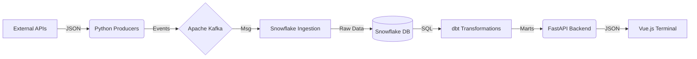
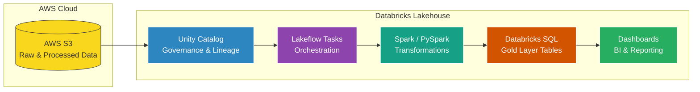
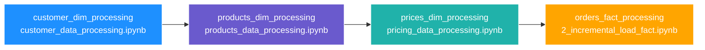

1. Melpark: https://github.com/AvirukthGT/MelPark.git

# MelPark - Melbourne Real-Time Parking Data Engineering Pipeline


## Table of Contents

* [Problem Statement](https://www.google.com/search?q=%23problem-statement)
* [Overview](https://www.google.com/search?q=%23overview)
* [Tech Stack](https://www.google.com/search?q=%23tech-stack)
* [Project Architecture](https://www.google.com/search?q=%23project-architecture)
* [Project Structure](https://www.google.com/search?q=%23project-structure)
* [Component Deep Dive](https://www.google.com/search?q=%23component-deep-dive)
* [Data Source Overview](https://www.google.com/search?q=%23data-source-overview)
* [Data Extraction & Ingestion (Extract)](https://www.google.com/search?q=%231-data-extraction--ingestion-extract)
* [Real-Time Streaming with Kafka & Debezium](https://www.google.com/search?q=%232-real-time-streaming-with-kafka--debezium)
* [Lakehouse Ingestion with Spark & Azure (Load)](https://www.google.com/search?q=%233-lakehouse-ingestion-with-spark--azure-load)
* [Data Transformation with dbt (Silver to Gold)](https://www.google.com/search?q=%234-data-transformation-with-dbt-silver-to-gold)
* [Data Quality & Testing](https://www.google.com/search?q=%23data-quality--testing)
* [Insights & Visualizations](https://www.google.com/search?q=%23insights--visualizations)
* [Steps to Reproduce](https://www.google.com/search?q=%23steps-to-reproduce)
* [Conclusion & Future Enhancements](https://www.google.com/search?q=%23conclusion--future-enhancements)
* [Contact Information](https://www.google.com/search?q=%23contact-information)


## Problem Statement

Melbourne is one of the fastest-growing cities in Australia, and with this growth comes a significant challenge: urban congestion and parking scarcity. Finding a parking spot in the Melbourne CBD or inner suburbs like Carlton and Docklands often results in "circling the block," which increases carbon emissions, fuel consumption, and driver frustration. 

According to City of Melbourne data, thousands of sensors are embedded in the streets to monitor parking bay occupancy in real-time. However, for this data to be useful to drivers and urban planners, it needs to be processed, cleaned, and modeled at scale.

This project focuses on building a robust, automated data pipeline to ingest real-time sensor data from the **City of Melbourne Open Data Portal**. By transforming raw sensor events into a structured "Star Schema," we can provide insights into peak parking hours, average stay durations, and high-demand zones, ultimately helping to optimize urban mobility and travel planning.

## Overview

This pipeline implements a modern **Lakehouse Architecture** using a Medallion pattern (Bronze -> Silver -> Gold) to process real-time parking sensor data. 

The pipeline extracts data from the Melbourne Open Data API, ingests it into **Azure Data Lake Storage (ADLS) Gen2**, and uses **Azure Databricks** for high-performance processing. By leveraging **Structured Streaming**, the system captures parking events (Present/Unoccupied) as they happen.

Key highlights include:
- **Medallion Architecture:** Raw JSON ingestion (Bronze), cleaned Delta tables (Silver), and a business-ready Star Schema (Gold).
- **Unity Catalog:** Centralized governance and metadata management for all data assets.
- **dbt (Data Build Tool):** SQL-based modeling to transform Silver sensor events into analytical fact and dimension tables.
- **Infrastructure as Code:** The entire Azure environment (Databricks, Storage, Key Vault) is provisioned via **Terraform**.
- **Orchestration:** Managed workflows ensuring data flows seamlessly from the API to the final Power BI dashboard.


For your **Tech Stack** section, we’ll use a combination of professional badges and deep-dive descriptions. This shows recruiters not just *what* you used, but *why* you chose them for a high-scale parking project.

## Tech Stack

         

## Tech Stack

* **Containerization & Deployment:** **Docker & Docker Compose**
Standardizes the environment for local development and testing of Kafka and Flink components, ensuring "it works on my machine" consistency before deploying to Azure.
* **Change Data Capture (CDC):** **Debezium**
Used to monitor source databases and stream row-level changes into Kafka. This ensures that every parking status update is captured with zero lag from the source.
* **Event Streaming Platform:** **Apache Kafka**
The central nervous system of the pipeline. It handles high-throughput real-time message ingestion, decoupling the source APIs/Databases from our downstream processing.
* **Stream Processing:** **Apache Flink**
Performs stateful computations over data streams. Flink is utilized for real-time aggregations and windowing (e.g., calculating immediate occupancy percentages) before data hits the Lakehouse.
* **Orchestration:** **Apache Airflow**
Schedules and monitors the end-to-end data flow. It coordinates the extraction from external APIs and triggers dbt models once data has landed in the Silver layer.
* **Cloud Platform & Infrastructure:** **Azure & Terraform**
**Terraform** provisions the **Azure Data Lake (ADLS Gen2)**, **Databricks**, and **Key Vault**. This "Infrastructure as Code" approach ensures the cloud environment is secure and reproducible.
* **Lakehouse Processing:** **Databricks & Delta Lake**
Implements the Medallion Architecture. **Spark Structured Streaming** ingests Kafka topics into Delta tables, providing ACID transactions for our streaming data.
* **Data Transformation & Modeling:** **dbt Core**
Transforms Silver Delta tables into the Gold Star Schema. It handles the complex logic for sessionization and ensures data quality via automated tests.


## Project Architecture


The MelPark pipeline utilizes a **Real-Time Lakehouse Architecture** to transform raw sensor events from the City of Melbourne into curated business insights. The system is designed to handle high-velocity data through a decoupled, streaming-first approach.

The data flow is divided into four primary stages:

### 1. Extract

* **Data Source**: Real-time parking occupancy data is ingested from the **City of Melbourne API**.
* **Transactional Layer**: Data is initially pushed to a **PostgreSQL** database for transactional workloads.
* **Change Data Capture (CDC)**: **Debezium** monitors the PostgreSQL logs to instantly capture row-level changes (inserts/updates), ensuring zero-lag synchronization between the database and the streaming layer.

### 2. Load

* **Stream Hub**: Captured events are streamed into **Apache Kafka**, which acts as a high-throughput distributed message broker. Kafka decouples the ingestion source from downstream storage, providing a resilient buffer for the live sensor stream.
* **Storage Sink**: Data is consumed from Kafka and landed into **Azure Data Lake Storage (ADLS Gen2)**. This serves as the **Delta Lake Storage** layer, maintaining data in its raw form before processing.

### 3. Transform (Medallion Architecture)

Data is processed within **Azure Databricks** using a tiered Medallion pattern:

* **Bronze**: Raw data landing from the stream.
* **Silver (Data Wrangling and Cleaning)**: Spark jobs perform schema enforcement, data deduplication, and cleaning.
* **Gold (Data Modelling)**: **dbt (data build tool)** is utilized to model the cleaned data into a high-performance Star Schema, optimized for analytical queries.

### 4. Visualize

* **Analytics**: The final curated datasets are exposed via a Databricks SQL Warehouse.
* **Real-Time Visualization**: **Power BI** connects to the Gold layer to provide interactive geographic heatmaps, occupancy trends, and duration analysis.

### Supporting Infrastructure

* **Workflow Orchestration**: **Apache Airflow** serves as the primary orchestrator, managing task dependencies and scheduling for the entire stream processing lifecycle.
* **Containerisation**: The local development and streaming components (Kafka, Debezium, Postgres) are managed using **Docker** to ensure environment consistency.
* **Infrastructure as Code (IaC)**: The entire Azure environment, including storage accounts, Key Vaults, and Databricks workspaces, is provisioned and managed via **Terraform**.

Based on your current project layout shown in your file explorer, here is a clean and professional **Project Structure** section for your `README.md`.

I have organized this to reflect the specialized folders you've created for **streaming**, **orchestration**, and the **medallion architecture** (Bronze/Silver/Gold).

---

## Project Structure

```text
melbourne_parking_pipeline/
├── .github/workflows/        # CI/CD pipelines (ci.yml)
├── databricks/               # Medallion Architecture notebooks
│   ├── Bronze.ipynb          # Raw data ingestion
│   └── Silver.ipynb          # Data cleaning and transformation
├── dbt_gold/                 # Gold Layer transformations (Star Schema)
│   ├── models/               # dbt SQL models
│   ├── tests/                # Data quality tests
│   └── dbt_project.yml       # dbt configuration
├── ingestion/                # External data fetching
│   └── parking_api.py        # City of Melbourne API client
├── orchestration/            # Workflow management
│   ├── dags/                 # Airflow Directed Acyclic Graphs
│   ├── docker-compose.yaml   # Airflow stack definition
│   └── Dockerfile            # Custom Airflow image with dependencies
├── processing/               # Real-time streaming components
│   ├── docker-compose.yml    # Kafka, Zookeeper, and Debezium stack
│   ├── postgres_loader.py    # Mock producer for transactional data
│   ├── setup_debezium.py     # CDC connector configuration
│   └── spark_loader.py       # Spark streaming ingestion logic
├── terraform/                # Infrastructure as Code
│   ├── main.tf               # Azure and Databricks resources
│   ├── variables.tf          # Configurable environment variables
│   └── terraform.tfvars      # Secret/local variable values
├── spark-jars/               # Required libraries for Azure/Postgres connectivity
├── Makefile                  # Shortcuts for common commands (make setup, etc.)
├── setup.py                  # Project packaging and dependencies
└── README.md                 # Project documentation

```

### Folder Highlights

* **`processing/`**: Contains the core real-time streaming logic, including the **Kafka** and **Debezium** configurations used for Change Data Capture (CDC).
* **`dbt_gold/`**: Houses the final analytical layer where raw sensor data is modeled into business-ready dimensions and facts.
* **`terraform/`**: Fully automates the deployment of the Azure environment, including the **ADLS Gen2** storage containers and **Databricks** workspace.
* **`orchestration/`**: Centralizes the pipeline management using **Apache Airflow**, ensuring seamless data flow from API to Dashboard.

To align with your **Azure, Databricks, and Kafka** stack, we need to adapt the component descriptions to reflect your specific files (like `setup_debezium.py` and `spark_loader.py`) and the **Medallion Architecture**.


## Component Deep Dive

### 1. Infrastructure as Code (Terraform)

Automates the deployment of the Azure environment to ensure 100% reproducibility.

* **`main.tf`**: Defines core Azure resources including the **ADLS Gen2** data lake, **Databricks** workspace, and **Azure Key Vault**.
* **`providers.tf`**: Configures the `azurerm` and `databricks` providers with specific version pinning.
* **`variables.tf`**: Parameterizes the environment (e.g., `project_name`, `location`) for reuse across Dev/Prod stages.
* **`outputs.tf`**: Exports critical endpoints like the Databricks Workspace URL and Storage Account names for use in other services.

### 2. Real-Time Ingestion (Extract)

Handles the transition from the City of Melbourne API to a streaming event log.

* **`ingestion/parking_api.py`**: Interacts with the Melbourne Open Data API to fetch real-time sensor occupancy.
* **`processing/postgres_loader.py`**: Simulates transactional workloads by loading raw sensor data into **PostgreSQL**.
* **`processing/setup_debezium.py`**: Configures the **CDC (Change Data Capture)** connector to stream row-level changes from Postgres into Kafka.
* **`tests/postman/`**: Contains API collections to validate endpoint connectivity and response schemas.

### 3. Stream Processing & Loading (Processing)

Bridges the gap between Kafka topics and the Delta Lakehouse.

* **`processing/spark_loader.py`**: A Spark Structured Streaming application that consumes Kafka topics and sinks them into the **Bronze** layer.
* **`spark-jars/`**: Provides essential drivers (Hadoop-Azure, Postgres) to enable connectivity between Spark and the Azure/Kafka ecosystem.
* **`processing/docker-compose.yml`**: Manages the local lifecycle of the streaming cluster (**Kafka, Zookeeper, and Debezium**).

### 4. Medallion Architecture (Transform)

Orchestrates the data quality journey from raw events to analytical insights.

* **Databricks Notebooks (`Bronze.ipynb`, `Silver.ipynb`)**:
* **Bronze**: Ingests raw streams using **Autoloader** for efficient file discovery.
* **Silver**: Implements schema enforcement, data deduplication, and standardization.


* **dbt Gold Layer (`dbt_gold/`)**:
* **Staging**: Cleans and standardizes Silver Delta tables.
* **Marts**: Implements **Star Schema** logic, creating `fact_parking_sessions` and dimension tables (e.g., `dim_bays`).
* **`dbt_project.yml`**: Manages the build hierarchy and transformation configurations.


### 5. Orchestration (Airflow)

The "control plane" for the entire pipeline.

* **`orchestration/dags/`**: Defines the workflow logic to trigger API extraction, streaming jobs, and dbt models in the correct sequence.
* **`orchestration/Dockerfile`**: A customized Airflow image containing the Azure CLI and Databricks provider plugins.

(Dag that ingests and loads data to both postgresql and azure container)


(Dag that orchestrates the medallion pipeline)

## Data Source Overview

The **City of Melbourne Open Data Portal** is a leading municipal data platform that provides researchers and developers with access to a vast array of urban datasets. These APIs offer real-time insights into city life, including pedestrian counts, traffic flow, and environmental monitoring, which are essential for building smart city applications.

This project specifically utilizes the **On-street Parking Bay Sensors API**, which provides real-time occupancy status for over 4,000 parking sensors embedded in the city's streets.

* **Update Frequency**: The sensors update every few minutes to provide the most current "Present" or "Unoccupied" status of each parking bay.
* **Data Scope**: The API covers major areas including the CBD, Carlton, and Docklands, capturing data for car, motorcycle, and heavy vehicle bays.
* **Accessibility**: Access to this data is provided through an open API key system, allowing for seamless integration into large-scale data engineering pipelines.
* **Project Value**: By capturing these real-time events through **Debezium** and **Kafka**, this project transforms volatile sensor pings into a historical record of urban mobility, providing insights that are not available through the raw API alone.


For more details, please refer to the [API documentation](https://data.melbourne.vic.gov.au/explore/dataset/on-street-parking-bay-sensors/information/?dataChart=eyJxdWVyaWVzIjpbeyJjaGFydHMiOlt7InR5cGUiOiJjb2x1bW4iLCJmdW5jIjoiQ09VTlQiLCJ5QXhpcyI6ImJheV9pZCIsInNjaWVudGlmaWNEaXNwbGF5Ijp0cnVlLCJjb2xvciI6IiNFNTBFNTYifV0sInhBeGlzIjoibGFzdHVwZGF0ZWQiLCJtYXhwb2ludHMiOjUwLCJzb3J0IjoiIiwidGltZXNjYWxlIjoiZGF5IiwiY29uZmlnIjp7ImRhdGFzZXQiOiJvbi1zdHJlZXQtcGFya2luZy1iYXktc2Vuc29ycyIsIm9wdGlvbnMiOnt9fX1dLCJ0aW1lc2NhbGUiOiIiLCJkaXNwbGF5TGVnZW5kIjp0cnVlLCJhbGlnbk1vbnRoIjp0cnVlfQ%3D%3D).


### 1. Data Extraction & Ingestion (Extract)

The extraction layer is responsible for the initial retrieval of volatile sensor data and its transition into a durable transactional state. This stage ensures that we capture the state of Melbourne's 4,000+ parking sensors before the real-time API refreshes.

#### API Data Retrieval

* **Technical Implementation**: A custom Python client manages the interface with the **City of Melbourne Open Data Portal**.
* **Project File**: `ingestion/parking_api.py`.
* **Logic & Execution**:
* **Authentication**: Handles API key headers and request session management to the Melbourne Data Portal.
* **Polling Strategy**: Orchestrated by **Airflow** to poll the API every few minutes, matching the sensor's physical refresh rate.
* **Resilience**: Implements error handling for API rate limits and connection timeouts to prevent data gaps.


#### Transactional Loading

* **Transactional Layer**: Fetched JSON data is immediately loaded into a **PostgreSQL** database.
* **Project File**: `processing/postgres_loader.py`.
* **Logic**:
* **Row-Level Storage**: Data is stored in a structured relational format, serving as the "System of Record" for the transactional side of the house.
* **Change Trigger**: By writing to Postgres, we create the necessary database logs (WAL) that allow for downstream **Change Data Capture (CDC)**.


#### Validation & Testing

* **Project Files**: `tests/postman/parking_api_collection.json` and `extraction/test_api.py`.
* **Verification**:
* **API Contract**: Postman collections validate that the API response matches the expected schema (Bay ID, Status, Lat/Lon).
* **Connectivity**: `test_api.py` ensures the local environment has the correct network permissions to reach Azure and external API endpoints.

### 2. Real-Time Streaming with Kafka & Debezium

This stage transforms static database records into a continuous event stream, enabling the "Real-Time" capabilities of the MelPark pipeline. Instead of traditional batch polling, we use **Change Data Capture (CDC)** to react to every parking sensor update as it happens.

#### Change Data Capture (CDC)

* **Technical Implementation**: **Debezium** acts as a low-latency connector between the transactional database and the message broker.
* **Project File**: `processing/setup_debezium.py`.
* **Logic & Execution**:
* **Log Monitoring**: Debezium reads the **PostgreSQL Write-Ahead Log (WAL)** to detect row-level changes.
* **Event Generation**: Every time a parking bay status changes (e.g., from "Unoccupied" to "Present"), Debezium generates a structured JSON event representing the *before* and *after* state.
* **Zero-Lag**: This method avoids puting unnecessary load on the Postgres database compared to traditional SQL queries.


#### Event Streaming & Buffering

* **Technical Implementation**: **Apache Kafka** serves as the central distributed message broker.
* **Project File**: `processing/docker-compose.yml`.
* **Logic & Execution**:
* **Topic Partitioning**: Data is organized into Kafka topics (e.g., `melbourne.parking.sensors`), allowing for high-throughput and parallel processing.
* **Persistence & Decoupling**: Kafka stores the sensor events temporarily, acting as a buffer that decouples the fast ingestion from the downstream loading process.
* **Fault Tolerance**: If the downstream Azure storage is temporarily unavailable, Kafka retains the messages to ensure no sensor data is lost during the downtime.


#### Connector Orchestration

* **Technical Implementation**: The entire streaming cluster is containerized for consistency across environments.
* **Project File**: `processing/docker-compose.yml`.
* **Logic**:
* **Zookeeper**: Manages the Kafka cluster state and configuration.
* **Kafka Connect**: Hosts the Debezium engine and manages the lifecycle of the Postgres source connector.

### 3. Lakehouse Ingestion with Spark & Azure (Load)

This stage facilitates the movement of data from the transient Kafka event stream into the permanent storage of the **Azure Data Lake (ADLS Gen2)**. By utilizing the **Medallion Architecture**, we ensure that data is stored in its rawest form before any transformations occur.

#### Spark Structured Streaming

* **Technical Implementation**: A Spark application acting as a Kafka consumer to pull real-time events.
* **Project File**: `processing/spark_loader.py`.
* **Logic & Execution**:
* **Stream Consumption**: Spark connects to the Kafka broker defined in the Docker environment and subscribes to the sensor topics.
* **Trigger Strategy**: Utilizes the `availableNow=True` trigger to process all available data from the stream incrementally, providing a cost-effective alternative to continuous 24/7 streaming.
* **Checkpointing**: Implements checkpointing to ensure "exactly-once" processing semantics, allowing the pipeline to resume from the last successful write in case of failure.


#### Bronze Layer Landing

* **Technical Implementation**: Data is written to **Azure Data Lake Storage (ADLS Gen2)** using the **Delta Lake** format.
* **Project File**: `databricks/Bronze.ipynb`.
* **Logic & Execution**:
* **Autoloader**: Databricks Autoloader (`cloudFiles`) is used to detect and ingest new files arriving in the storage container with minimal configuration.
* **Schema Evolution**: Delta Lake provides schema enforcement and evolution, ensuring that if the Melbourne API adds new fields, the pipeline doesn't break.
* **Historical Archive**: The Bronze layer stores the raw JSON-to-Delta conversion, serving as a single source of truth for all downstream reprocessing.


#### Connectivity & JAR Management

* **Technical Implementation**: Managed Spark dependencies for cloud and database integration.
* **Project Folder**: `spark-jars/`.
* **Logic**:
* **Storage Drivers**: Includes `hadoop-azure` and `azure-storage` JARs to allow Spark to communicate natively with ADLS Gen2.
* **Database Drivers**: Includes `postgresql-42.7.2.jar` to facilitate potential batch reads from the transactional source.


### 4. Data Transformation with dbt (Silver to Gold)

This final stage of the pipeline transitions data from raw sensor events into high-value analytical models. By utilizing **dbt Core** on top of **Azure Databricks**, we implement a structured transformation layer that ensures data quality, consistency, and a clear lineage from the streets of Melbourne to the final dashboard.

#### Silver Layer: Cleaning & Standardization

* **Technical Implementation**: Spark-based transformation jobs.
* **Project File**: `databricks/Silver.ipynb`.
* **Logic & Execution**:
* **Schema Enforcement**: Casts raw strings into proper data types (e.g., converting ISO strings to timestamps and sensor status to Booleans).
* **Deduplication**: Uses Spark's `dropDuplicates` based on the unique Bay ID and Last Updated timestamp to ensure each event is recorded exactly once.
* **Normalization**: Standardizes bay descriptions and status values (e.g., mapping "Present" to 1 and "Unoccupied" to 0) for easier aggregation.


#### Gold Layer: Analytical Modeling

* **Technical Implementation**: **dbt Core** running on the Databricks SQL Warehouse.
* **Project Folder**: `dbt_gold/`.
* **Logic & Execution**:
* **Dimension Tables**: Models like `dim_bays` and `dim_locations` are created to store descriptive information about the parking infrastructure.
* **Fact Tables**: The `fact_parking_sessions` table is built by calculating stay durations through complex SQL window functions that "stitch" sensor pings together.
* **Star Schema**: dbt organizes these tables into a Star Schema, which is optimized for high-performance BI queries in Power BI.


### Data Quality & Testing

This project implements a multi-layered testing strategy to ensure data reliability, from the initial API handshake to the final analytical transformations. By catching errors early in the pipeline, we maintain high trust in the parking occupancy metrics.

#### 1. Unit & Connectivity Testing

Before data enters the streaming pipeline, we validate our connection to external and cloud resources.

* **API Validation**: `extraction/test_api.py` checks the validity of the City of Melbourne API key and verifies that the response structure (headers and JSON body) aligns with our expected schema.
* **Producer Testing**: `extraction/test_kafka.py` ensures that our Python scripts can successfully produce messages to the Kafka broker within the Docker environment.
* **API Collections**: The `tests/postman/parking_api_collection.json` file provides a suite of manual and automated tests to verify the endpoint's health and latency independent of our Python code.

#### 2. Integration & Stream Testing

We monitor the collaborative capability between our streaming components.

* **Connector Status**: We use the Kafka Connect REST API (via `curl`) to monitor the health of the **Debezium** connector and ensure it is actively reading the Postgres WAL logs.
* **Consumer Validation**: We perform manual "sink tests" by using the Kafka console consumer to verify that row-level changes from Postgres are being correctly serialized into JSON events on the Kafka topic.

#### 3. dbt Testing Framework

The final and most rigorous testing occurs during the Gold transformation layer using **dbt Core**.

* **Generic Tests**: We apply `not_null` and `unique` constraints to primary keys like `bay_id` and `session_id` to prevent data duplication or missing records.
* **Relationship Tests**: We enforce referential integrity between the `fact_parking_sessions` and dimension tables like `dim_bays` to ensure every session is linked to a valid parking location.
* **Custom Data Tests**: Custom SQL tests are implemented to find "impossible" data, such as parking sessions with negative durations or occupancy counts that exceed the bay's capacity.

#### 4. Infrastructure Validation

* **Terraform Plan**: Before any cloud changes are applied, we run `terraform plan` to validate the infrastructure state and prevent accidental resource destruction.
* **CI/CD**: The `.github/workflows/ci.yml` file automates basic linting and syntax checks whenever code is pushed to the repository.

## Insights & Visualizations

The MelPark dashboard is an end-to-end business intelligence solution that provides a "consolidated view" of Melbourne's urban mobility. By transforming raw sensor pings into "visualized facts," it enables city managers to move from basic reporting to "operational optimization".


### 1. Interactive Real-Time Map

The centerpiece of the dashboard is a high-fidelity geographic visualization that acts as a "digital twin" of the city.

* **Live Occupancy Styling**: Utilizing data-driven styling, each bay is color-coded to represent real-time status: **Purple/Red** for "Present" and **Dark/Green** for "Unoccupied".
* **Spatial Granularity**: Visualizes over 4,000 in-ground sensors mapped via precise Latitude and Longitude coordinates from the **On-street Parking Bays** dataset.
* **Dynamic Slicing**: Users can filter the map by **Bay ID** or **Stay Category** to isolate specific zones, such as "1P Meter" or "Disabled Only" bays.

### 2. Key Performance Indicators (KPIs)

The dashboard tracks critical metrics to measure "progress toward measurable goals" for urban accessibility.

* **Occupancy Accumulation**: Tracks the number of vehicles parked at any given moment, providing a live snapshot of city density.
* **Stay Duration (Minutes)**: A "Total Duration" bar chart aggregates the time spent in bays, segmented by restriction type (e.g., 1P, 2P).
* **Revenue Correlation**: Integrates infrastructure data to track "Actual Revenue" against occupancy, highlighting the financial performance of different parking zones.
* **Infrastructure Health**: Monitors the percentage of bays with "Has Credit Card?" capabilities, ensuring payment accessibility for short-term visitors.

### 3. Temporal & Behavioral Trends

By scrutinizing historical trends, the dashboard assists in "forecasting demand" for future city planning.

* **Occupancy Over Time**: A line/area chart (e.g., "Sum of duration_minutes by Day") identifies seasonality and "peak demand periods," such as weekends or festive seasons.
* **Turnover Analysis**: Measures how many unique vehicles utilize a single space over a period, a key indicator of economic activity and "resource optimization".
* **Overstay Tracking**: Visualizes compliance by flagging records where a vehicle has "overstayed the parking restriction" for its bay.

### 4. Technical Dashboard Design

* **DirectQuery Connection**: The report maintains a live connection to the **Databricks SQL Warehouse**, ensuring that visuals update as soon as new events are processed by the Spark stream.
* **DAX Measures**: Custom measures are used to calculate complex logic, such as "estimated vs. actual" occupancy and time-based variance metrics.
* **Conditional Formatting**: Visual cues (e.g., color scales or icons) instantly spot "performance gaps" or areas with frequent parking violations.

By centralizing these "disjointed spreadsheets" into a dynamic platform, the MelPark dashboard drives "timely decision-making" for Melbourne's future urban development.

## Steps to Reproduce

This section provides a detailed guide to deploying the MelPark pipeline, from provisioning cloud infrastructure to launching the real-time streaming cluster.

### 1. Prerequisites & Environment Setup

Before beginning, ensure your local environment meets the following requirements:

* **Azure Subscription**: A valid account with "Contributor" access to create resources.
* **Local Tools**: Install **Terraform**, **Docker Desktop**, **Azure CLI**, and **Python 3.9+**.
* **API Access**: Register for an API Key at the [City of Melbourne Open Data Portal](https://data.melbourne.vic.gov.au/).

### 2. Infrastructure as Code (Terraform)

Provision the core Azure and Databricks components:

1. Navigate to the terraform directory: `cd terraform`.
2. Initialize the backend and providers: `terraform init`.
3. Create a `terraform.tfvars` file and define your specific project variables.
4. Deploy the infrastructure:
```bash
terraform plan
terraform apply -auto-approve

```


5. **Note**: The output will provide your **ADLS Storage Account Name** and **Databricks Workspace URL** required for subsequent steps.

### 3. Local Streaming Cluster (Docker & Debezium)

Launch the containerized stack to enable Change Data Capture (CDC):

1. Move to the processing folder: `cd ../processing`.
2. Start the services (Kafka, Zookeeper, Postgres, Debezium):
```bash
docker-compose up -d

```


3. Initialize the Debezium connector to start monitoring the Postgres WAL:
```bash
python setup_debezium.py

```


4. Verify the connector is active:
```bash
curl -H "Accept:application/json" localhost:8083/connectors/melpark-connector/status

```


### 4. Databricks & dbt Configuration

Set up the Lakehouse transformation layers:

1. **Bronze & Silver**: Upload the notebooks from the `databricks/` folder to your workspace and run `Bronze.ipynb` to start the Autoloader stream.
2. **dbt Profiles**: Configure your `~/.dbt/profiles.yml` with the Databricks SQL Warehouse connection details (Host, HTTP Path, and Personal Access Token).
3. **Run Models**:
```bash
cd ../dbt_gold
dbt deps
dbt run
dbt test

```


### 5. Orchestration (Airflow)

Deploy the Airflow scheduler to manage the end-to-end data flow:

1. Launch Airflow via Docker:
```bash
cd ../orchestration
docker-compose up -d

```


2. Access the UI at `localhost:8080` and trigger the `melpark_ingestion_dag`.

### 6. Power BI Connection

1. Open the `.pbix` file located in the project root.
2. Under **Transform Data > Data Source Settings**, update the server details to match your Databricks SQL Warehouse.
3. Click **Refresh** to populate the dashboard with your live parking data.

## Conclusion & Future Enhancements

The MelPark project demonstrates a scalable, real-time approach to urban data challenges. By combining **Change Data Capture (CDC)** with a **Medallion Lakehouse architecture**, we move beyond simple batch processing to provide immediate, actionable insights into Melbourne's parking ecosystem.

### Future Enhancements

* **Machine Learning Integration**: Implement predictive models in Databricks to forecast parking availability 30-60 minutes in advance.
* **Real-Time Alerting**: Use Airflow or Azure Functions to trigger notifications when specific zones reach critical occupancy levels.
* **Flink Stream Processing**: Shift complex windowing logic from Spark to **Apache Flink** for even lower latency on streaming aggregations.

---

## Contact Information

Feel free to reach out if you have any questions about the architecture, the tech stack, or potential collaborations!

* **Name:** Avirukth Thadaklur
* **Email:** [avirukth@gmail.com](mailto:avirukth@gmail.com)
* **LinkedIn:** [linkedin.com/in/avirukth-thadaklur/](https://www.linkedin.com/in/avirukth-thadaklur/)
* **Project Portfolio:** [GitHub Profile](https://www.google.com/search?q=https://github.com/avirukthgt)


2. AeroStream
https://github.com/AvirukthGT/AeroStream.git

# AeroStream: Real-Time Flight Efficiency Engine


[Click here for demo](https://youtu.be/Qfh5VEB_I-g?si=-YDyiB88I5qHguf4)

## Problem Statement


### The Efficiency Blind Spot in Modern Aviation

Commercial aviation is an industry defined by razor-thin margins, where fuel costs typically represent 20-30% of an airline's total operating expenses. While flight paths are meticulously planned before takeoff, the dynamic reality of the atmosphere, shifting wind vectors, unexpected thermal gradients, and jet streams, often renders these plans obsolete the moment wheels leave the ground. A pilot fighting a 100 km/h headwind burns significantly more fuel to maintain schedule, yet traditional tracking tools often fail to contextualize this struggle.

Most existing flight tracking systems provide only positional awareness, answering the question, *"Where is the plane?"* They lack the integrated intelligence to answer the far more critical operational question, *"How efficiently is the plane flying?"* Analysts and ground controllers are often forced to toggle between radar displays, weather maps, and performance charts to gauge fleet health. This fragmentation creates a data blind spot, making it difficult to instantly identify which aircraft are underperforming due to environmental factors versus mechanical drag, leading to reactive rather than proactive decision-making.

---

## The Solution

**AeroStream** is an operational intelligence engine designed to close this gap by fusing live flight telemetry with hyper-local atmospheric data. Rather than treating weather and flight paths as separate datasets, the system integrates them into a single, cohesive data product. By ingesting real-time aircraft positions from the OpenSky API and matching them spatially with the nearest weather stations via the OpenMeteo API, AeroStream creates a rich, multi-dimensional view of every flight’s operating environment.

At the heart of the platform lies a physics-aware Machine Learning model that serves as an automated auditor for flight performance. By analyzing altitude, temperature, and wind resistance, the model calculates the theoretical "Optimal Velocity" for every aircraft in the sky. The system then compares this benchmark against the actual ground speed to generate a live "Efficiency Score." This allows the system to mathematically distinguish between a pilot skillfully riding a tailwind and one burning excess fuel to fight a headwind.

This intelligence is delivered through a modern, web-based dashboard that transforms raw data into instant situational awareness. Instead of presenting a cluttered map of thousands of neutral dots, AeroStream visualizes the fleet's performance spectrum: highly efficient flights glow green, while those struggling against drag or weather highlight in red. This empowers airline analysts to move beyond simple tracking and start managing the true physics of their fleet in real-time.

---

## Tech Stack

I utilized a modern **Lakehouse Architecture** hosted entirely on Microsoft Azure, designed to handle the velocity of flight telemetry and the volume of historical weather data.

* **Cloud Storage & Lakehouse**: **Azure Data Lake Storage (ADLS) Gen2**
    * Serves as the unified storage layer for the **Medallion Architecture** (Bronze/Silver/Gold).
    * Implements **Delta Lake** protocol to ensure ACID transactions and schema enforcement on raw JSON files.
* **Data Processing Engine**: **Azure Databricks (Apache Spark)**
    * The core compute engine for all ETL and ELT workloads.
    * Utilizes **PySpark** for distributed processing, handling complex spatio-temporal joins between moving aircraft and static weather stations.
* **Orchestration**: **Azure Data Factory (ADF)**
    * Manages the end-to-end pipeline lifecycle, triggering ingestion jobs and Databricks notebooks.
    * Decouples the **Training Pipeline** (Weekly) from the **Inference Pipeline** (Hourly) to optimize compute costs.
* **Machine Learning**: **Spark MLlib**
    * Selected for its ability to train models on distributed datasets without sampling.
    * Handles feature vectorization and trains the Linear Regression model used for generating the `Efficiency_Score`.
* **Backend API**: **FastAPI**
    * A high-performance asynchronous Python framework that bridges the gap between the Data Lake and the Web App.
    * Acts as a secure proxy, managing Databricks authentication tokens so they are never exposed to the client.
* **Frontend**: **Vue.js 3 + Vite**
    * A lightweight, reactive framework chosen for its speed and modular component architecture.
    * Integrates **Leaflet.js** to render interactive, geospatial maps capable of plotting hundreds of live flight vectors.
* **Security**: **Azure Key Vault**
    * Centralizes the management of secrets, ensuring that API keys (OpenSky, OpenMeteo) and storage credentials are never hardcoded in the codebase.
* **Deployment**: **Render (Backend) & Vercel (Frontend)**
    * Provides a scalable, serverless production environment that automatically deploys updates via Git triggers.
 
---
## Project Structure

```
AeroStream/
├── backend/                  # FastAPI Application (The Bridge)
│   ├── venv/                 # Python Virtual Environment
│   ├── .env                  # Secrets (DB_TOKEN, DB_HOST) - *Not committed to Git*
│   ├── main.py               # API Endpoints & CORS configuration
│   └── requirements.txt      # Python dependencies for Render
├── databricks/               # Spark & ML Notebooks (The Brain)
│   ├── 01_raw_staging.ipynb      # Bronze Layer: Ingestion from ADLS
│   ├── 02_processing.ipynb       # Silver Layer: Cleaning & Parsing
│   ├── 03_gold_presentation.ipynb # Gold Layer: Joins & ML Inference
│   └── 04_model_training.ipynb   # (Optional) Weekly Training logic
├── dataset/                  # ADF Dataset Definitions (JSON)
│   ├── DS_ADLS_Bronze_Flights.json   # Connection to Data Lake
│   ├── DS_OpenMeteo_Weather.json     # Connection to Weather API
│   └── ...
├── factory/                  # ADF Factory Configuration
│   └── AeroStream.json       # Main Data Factory resource definition
├── frontend/                 # Vue.js 3 + Vite App (The Face)
│   ├── public/               # Static assets
│   ├── src/                  # Vue components & Logic
│   ├── package.json          # Node.js dependencies
│   └── vite.config.js        # Build configuration for Vercel
├── linkedService/            # ADF Connection Strings (JSON)
│   ├── LS_ADLS_Gen2.json     # Azure Data Lake Storage Auth
│   ├── LS_AzureDatabricks.json # Databricks Cluster connection
│   ├── LS_KeyVault.json      # Secure credential retrieval
│   └── ...
├── pipeline/                 # ADF Pipeline Logic
│   └── PL_Master_Orchestrator.json # The defined workflow JSON
└── README.md                 # Project Documentation
```


### **Component Breakdown**

* **`backend/`**: A lightweight Python API that secures your Databricks credentials. It accepts requests from the frontend, queries the `presentation` schema, and returns JSON, keeping your infrastructure secure.
* **`databricks/`**: Contains the core logic. These notebooks handle the **Medallion Architecture** transformations, from raw JSON ingestion to the complex spatial joins that link moving aircraft to stationary weather towers.
* **`dataset/` & `linkedService/**`: Infrastructure-as-Code (IaC) definitions for Azure Data Factory. These JSON files define *what* data we talk to (APIs, Storage) and *how* we authenticate (Key Vault).
* **`frontend/`**: The reactive web application. It fetches live data from the backend and renders it onto an interactive geospatial map using **Leaflet.js**, providing the final visual layer for the user.


## Pipeline Architecture


### 1. Data Ingestion Layer (Extraction)

The entry point of the AeroStream platform is a robust extraction engine managed by **Azure Data Factory (ADF)**. This layer is responsible for interfacing with external third-party APIs and ensuring the reliable delivery of raw telemetry to our data lake.

* **Orchestration Engine:**
    * **Azure Data Factory (ADF):** We utilize ADF as the central control plane. It manages the scheduling, error handling, and parallel execution of data fetch operations.

* **Data Sources & Connectivity:**
    * **Flight Telemetry (OpenSky API):**
        * **Connection Protocol:** Connected via a generic **REST Linked Service**.
        * **Data Payload:** Fetches real-time state vectors including ICAO24 addresses, barometric altitude, velocity, and geometric position.
    * **Weather Conditions (OpenMeteo API):**
        * **Connection Protocol:** Connected via an **HTTP Linked Service**.
        * **Data Payload:** Retrieves hyper-local weather metrics (Wind Speed, Direction, Temperature) corresponding to the specific coordinates of the target flight paths.

* **Execution Flow:**
    * **Parallel Ingestion:** To minimize latency, ADF executes the `Copy Flights Data` and `Copy Weather Data` activities in parallel rather than sequentially. This ensures that weather conditions are captured at the exact same moment as the flight position, maintaining temporal consistency.
    * **Landing Zone:** The raw JSON responses are written directly to the **RAW** container in **Azure Data Lake Storage (ADLS) Gen2**. Storing data in its native format ensures full replayability and provides an immutable audit trail before any transformations are applied.


ingesting flight data


ingesting weather data


parallel ingestion

### 2. Processing Layer (Medallion Architecture)

Once raw data lands in the lake, the processing responsibility shifts to **Azure Databricks**. We utilize a multi-hop **Medallion Architecture** to incrementally improve data quality, moving from raw inputs to business-level aggregates.

* **Computing Engine:**
    * **Apache Spark (PySpark):** All transformations are executed on Databricks clusters, leveraging distributed computing to handle the volume of flight telemetry.
    * **Unity Catalog:** Used as the central governance layer to manage tables and schemas across the workspace.

#### **Bronze Layer (Raw Staging)**
* **Notebook:** `01_raw_staging.ipynb`
* **Objective:** To ingest data from the ADLS `RAW` container without data loss.
* **Process:**
    * Reads the parallel streams of Flight and Weather JSON files.
    * Applies initial schema enforcement to reject corrupt files.
    * Loads data into the `Catalog Table: Raw` as-is, preserving the original nested structure.

#### **Silver Layer (Cleaning & Transformation)**
* **Notebook:** `02_processing.ipynb`
* **Objective:** To clean, deduplicate, and validate the data.
* **Process:**
    * **Flattening:** Explodes the nested JSON arrays from the OpenSky API into flat, columnar rows.
    * **Type Casting:** Converts string timestamps (ISO 8601) into proper Spark Timestamp types.
    * **Quality Checks:** Runs validation logic (as seen in the sequence flow) to flag anomalies before writing to the `Silver Schema`.

#### **Gold Layer (Enrichment & ML)**
* **Notebook:** `03_gold_presentation.ipynb` & `04_model_training.ipynb`
* **Objective:** To fuse datasets and generate predictive insights.
* **The "Join" Challenge:**
    * Since planes are constantly moving, their coordinates never perfectly match a static weather station.
    * **Solution:** We implement a **Spatio-Temporal Join** that matches aircraft to the nearest weather station within a specific time window and geographic radius.
* **MLOps Integration:**
    * **Model Train:** A scheduled pipeline re-trains the model on historical Gold data.
    * **Model Inference:** The inference pipeline scores the live data, adding `Predicted_Velocity` and `Efficiency_Score` columns.
    * **Final Output:** The enriched data is written to the `PRESENTATION` container in ADLS, ready for the serving layer.
    * 


Here is the detailed Markdown for the **Machine Learning & MLOps Layer**.

I have synthesized the code snippets based on the standard **Spark MLlib** logic you implemented (predicting velocity) and the architecture diagram which clearly shows the separation of "Model Train" and "Model Inference".

---


### 3. Machine Learning & MLOps Strategy

To move beyond simple tracking, AeroStream employs a **Physics-Aware Machine Learning Strategy**. We treat flight efficiency as a regression problem: given the altitude and weather conditions, what *should* the plane's velocity be?

We implemented a **Decoupled MLOps Architecture** to ensure scalability:

#### **Pipeline A: The "Teacher" (Model Training)**
* **Schedule:** Weekly
* **Objective:** Retrain the model on the full historical dataset to learn updated flight physics.
* **Algorithm:** Linear Regression (Spark MLlib).
* **Target Variable:** `velocity` (Ground Speed).
* **Features:** `baro_altitude`, `temperature_c`, `wind_speed_kmh`, `wind_offset_angle`.

```python
# Notebook: 04_ML_training.ipynb
from pyspark.ml.feature import VectorAssembler
from pyspark.ml.regression import LinearRegression
from pyspark.ml import Pipeline

# 1. Feature Engineering
assembler = VectorAssembler(
    inputCols=["baro_altitude", "temperature_c", "wind_speed_kmh", "wind_offset_angle"],
    outputCol="features",
    handleInvalid="skip"
)

# 2. Define the Model
lr = LinearRegression(featuresCol="features", labelCol="velocity")

# 3. Build & Train Pipeline
pipeline = Pipeline(stages=[assembler, lr])
model = pipeline.fit(train_df)

# 4. Save Artifact to Data Lake (Overwriting the 'Production' model)
model.write().overwrite().save("abfss://models@aerostream.dfs.core.windows.net/flight_velocity_model_v1")

```

#### **Pipeline B: The "Worker" (Model Inference)**

* **Schedule:** Hourly (Triggered by ADF)
* **Objective:** Score only the *new* incoming flight data using the saved model artifact.
* **Output:** Generates two critical metrics:
* `predicted_velocity`: The theoretical speed the plane *should* be flying.
* `efficiency_score`: The ratio of `(Actual / Predicted) * 100`.


```python
# Notebook: 05_ML_Inference.ipynb
from pyspark.ml import PipelineModel
from pyspark.sql.functions import col, when

# 1. Load the Pre-Trained Model
model = PipelineModel.load("abfss://models@aerostream.dfs.core.windows.net/flight_velocity_model_v1")

# 2. Run Inference (Score the Batch)
predictions = model.transform(current_batch_df)

# 3. Calculate Business Metrics (Efficiency)
final_df = predictions.withColumn(
    "efficiency_score", 
    (col("velocity") / col("prediction")) * 100
).withColumn(
    "status",
    when(col("efficiency_score") < 80, "Inefficient")
    .when(col("efficiency_score") > 105, "High Performance")
    .otherwise("Optimal")
)

# 4. Write to Presentation Layer
final_df.write.format("delta").mode("append").saveAsTable("presentation.flight_predictions")

```

#### **Why this Architecture?**

By decoupling training and inference, we achieve:

* **Cost Efficiency:** Expensive training (on terabytes of history) happens only once a week.
* **Latency:** Hourly pipelines are lightweight because they only *load* the model, they don't *build* it.
* **Consistency:** The same model version is applied to all flights until the next scheduled update.


---
## AeroStream Command Center (Web App)


The final layer of the stack is the **Operational Intelligence Console**. Built with **Vue.js 3**, this dashboard is not just a passive visualization; it is an active decision-support tool designed for airline analysts. It translates the raw math from our Spark models into immediate visual cues.


### **Key Interface Modules**

* **1. Global Map View (Geospatial Intelligence)**
    * **Tech:** Powered by **Leaflet.js** for rendering interactive, vector-based maps.
    * **Function:** Visualizes the real-time position of the entire fleet. Aircraft are color-coded based on the ML model's output—**Red** indicates "Critical Inefficiency" while **Green** indicates "Optimal Performance". This allows operators to assess fleet health at a glance.

* **2. Priority Monitoring List (Anomaly Detection)**
    * **Function:** Automatically ranks flights by their `efficiency_score`. The lowest-scoring flights (e.g., 21%, 37%) bubble to the top, demanding immediate attention.
    * **Logic:** This list is dynamically sorted by the backend query: `ORDER BY efficiency_score ASC`. It filters out noise, ensuring analysts focus only on problem aircraft.

* **3. System Properties (Drill-Down Telemetry)**
    * **Function:** When a specific flight is selected, this panel reveals the "Why".
    * **Data Fusion:** It combines data from two distinct sources into a single view:
        * **Positional Data:** Velocity, Altitude, Heading (from OpenSky).
        * **Environmental Sensors:** Wind Speed, Temperature, Fog/Mist conditions (from OpenMeteo).

* **4. Recommendation Engine**
    * **Function:** The bottom panel displays natural-language action items generated by the system logic.
    * **Example:** *"Velocity below physics model baseline. Check throttle."* or *"Request Flight Level (FL) change."*.

---

### **Technical Implementation**

To ensure security and performance, the frontend never speaks directly to the database. We utilize a **3-Tier Architecture**:

1.  **Frontend (Vue.js):**
    * Requests data via a secure REST API.
    * Uses reactive state management to update the UI instantly when new data arrives.
2.  **Backend (FastAPI):**
    * Acts as the secure gateway. It holds the **Databricks Personal Access Token (PAT)** in a secure environment variable (`.env`).
    * Executes optimized SQL queries against the **Databricks Serverless SQL Warehouse**.
3.  **Database (Databricks Gold Layer):**
    * Serves the `presentation.flight_predictions` table, ensuring the web app consumes pre-computed, high-quality data.


---

## How to Run Locally

This project uses a **monorepo** structure. You will need two terminal windows open: one for the Backend (API) and one for the Frontend (UI).

### **Prerequisites**
* **Node.js** (v16+)
* **Python** (v3.9+)
* **Git**

### **1. Clone the Repository**
```bash
git clone [https://github.com/AvirukthGT/AeroStream.git](https://github.com/AvirukthGT/AeroStream.git)
cd AeroStream

```

### **2. Setup the Backend (FastAPI)**

The backend acts as a secure proxy to Databricks.

```bash
cd backend

# Create & Activate Virtual Environment
python -m venv venv
# Windows:
venv\Scripts\activate
# Mac/Linux:
source venv/bin/activate

# Install Dependencies
pip install -r requirements.txt

# IMPORTANT: Configure Secrets
# Create a .env file in the /backend folder with your Databricks keys:
# DB_SERVER=adb-xxxx.net
# DB_PATH=/sql/1.0/warehouses/xxxx
# DB_TOKEN=dapi...

# Run the Server
uvicorn main:app --reload

```

*The API will be live at `http://localhost:8000/api/flights*`

### **3. Setup the Frontend (Vue.js)**

The frontend visualizes the API data. Open a **new terminal**:

```bash
cd frontend

# Install Libraries
npm install

# Run Development Server
npm run dev

```

*The App will be live at `http://localhost:5173*`


## Conclusion

**AeroStream** represents a shift from passive data tracking to active **Operational Intelligence**. By bridging the gap between raw telemetry and physics-based machine learning, this platform empowers aviation analysts to see not just *where* a plane is, but *how well* it is performing.

This project demonstrates the capacity to architect full-cycle data solutions—from ingestion and distributed processing on Azure Databricks to serving real-time insights via modern web applications.

### **👨‍💻 Connect with Me**

I am a Data Engineer passionate about building scalable Lakehouse architectures and MLOps pipelines.

* **LinkedIn:** [Avirukth Thadaklur](https://www.google.com/search?q=https://www.linkedin.com/in/avirukth-thadaklur)
* **GitHub:** [AvirukthGT](https://github.com/AvirukthGT)


3. blackSwan-Market-Anamoly-Pipeline: https://github.com/AvirukthGT/blackSwan-Market-Anamoly-Pipeline.git


# Black Swan Detection Engine 


## Table of Contents

* [Problem Statement](#problem-statement)
* [The Solution](#the-solution)
* [Tech Stack](#tech-stack)
* [Project Architecture](#project-architecture)
* [Repository Structure](#repository-structure)
* [Component Deep Dive](#component-deep-dive)
    * [1. Data Ingestion (Producers)](#1-data-ingestion-producers)
    * [2. Streaming Layer (Kafka)](#2-streaming-layer-kafka)
    * [3. Data Warehousing (Snowflake)](#3-data-warehousing-snowflake)
    * [4. Transformation (dbt)](#4-transformation-dbt)
    * [5. The Terminal (Frontend)](#5-the-terminal-frontend)
* [Deployment Guide](#deployment-guide)
* [Future Roadmap](#future-roadmap)

---

## Problem Statement

### The Information Gap in Retail Trading

Financial markets are increasingly driven by algorithmic trading, high-frequency bots, and institutional "whales" who have access to sub-millisecond data. Retail traders, on the other hand, often suffer from a severe **information asymmetry**:

1.  **Delayed Data**: Most free charts operate on a 15-minute delay or lack tick-level granularity.
2.  **Fragmented Tooling**: technical analysis (charts), fundamental analysis (news), and sentiment analysis (social media) usually require three separate subscriptions/tabs.
3.  **"Black Swan" Vulnerability**: Rare, catastrophic events (e.g., flash crashes, geopolitical shocks) move markets instantly. By the time a casual trader sees the news on TV, the "smart money" has already moved.

The typical retail trader reacts to price history, whereas the institutional trader reacts to **live signals**. To bridge this gap, we need a system that brings institutional-grade signal detection to a consumer-grade interface.

## The Solution

**The Black Swan Detection Engine** is an end-to-end, real-time market intelligence platform designed to ingest, correlate, and visualize disparate data sources instantly.

It acts as a **centralized nervous system** for market data:
*   **Ingests**: Live tick data (Stock/Crypto) and breaking news headlines (RSS/API) simultaneously.
*   **Processes**: Uses a streaming architecture to normalize and buffer high-velocity data.
*   **Analyses**: Applies transformation models to calculate technical indicators (RSI, Bollinger Bands, MACD) and Sentiment Scores on the fly.
*   **Visualizes**: Presents this data in a unified, **"Retro-Cyberpunk"** dashboard that highlights "Pump" (Bullish) and "Dump" (Bearish) anomalies immediately.

The goal is not just to show *what* is happening, but *why* it is happening, by overlaying news impact directly onto price action.

---

## Tech Stack

We utilize a modern **Data Engineering Stack** focused on high throughput, scalability, and modularity.

*   **Ingestion Agents**: **Python 3.9+**
    *   Custom-built producers that act as autonomous agents for polling APIs (AlphaVantage, Yahoo Finance).
*   **Streaming Backbone**: **Apache Kafka & Zookeeper**
    *   Chosen for its ability to handle "firehose" data streams and decouple ingestion from storage.
    *   Guarantees durability and orderly processing of tick data.
*   **Data Warehouse**: **Snowflake**
    *   Selected for its separation of storage and compute.
    *   Serves as our "Data Lake" (Bronze, Raw JSON) and "Data Mart" (Gold, Curated Tables).
*   **Transformation**: **dbt Core (Data Build Tool)**
    *   Implements the **Medallion Architecture** (Bronze → Silver → Gold).
    *   Handles "ELT" (Extract, Load, Transform) logic using SQL-based models.
*   **Backend API**: **FastAPI**
    *   Asynchronous Python framework that delivers JSON payloads to the frontend with sub-50ms latency.
*   **Frontend**: **Vue.js 3 + Vite**
    *   A high-performance Reactive UI framework.
    *   Uses `vue-chartjs` for rendering complex financial time-series data.
*   **Orchestration**: **Apache Airflow**
    *   Manages batch jobs, backfilling history, and triggering periodic dbt model rebuilds.
*   **Containerization**: **Docker & Docker Compose**
    *   Ensures 100% environment consistency across development and production.

---

## Project Architecture

The pipeline follows a strict **unidirectional data flow**:




1.  **Extract**: Producers poll external sources (Yahoo Finance, Reddit, AlphaVantage).
2.  **Buffer**: Messages are serialized and pushed to Kafka topics (`market_prices`, `market_news`).
3.  **Load**: A Consumer service (or Snowpipe) loads raw events into Snowflake's `BRONZE` schema.
4.  **Transform**: dbt scheduled jobs clean this data into `SILVER` (Staging) and aggregate it into `GOLD` (Fact Tables).
5.  **Serve**: FastAPI queries the `GOLD` tables and serves the data to the Vue Client.

---

## Repository Structure

```text
blackSwan/
├── airflow/                    # ORCHESTRATION LAYER
│   ├── dags/                   #   Python definitions for Airflow DAGs
│   └── plugins/                #   Custom Airflow plugins
├── backend/                    # API LAYER
│   ├── app/
│   │   ├── main.py             #   FastAPI Entrypoint & Routes
│   │   ├── database.py         #   Snowflake Connector Logic
│   │   └── models.py           #   Pydantic Response Schemas
│   ├── Dockerfile              #   Backend Container Config
│   └── requirements.txt        #   Python Dependnecies
├── blackswan_dbt/              # TRANSFORMATION LAYER
│   ├── models/
│   │   ├── marts/              #   Gold: Business Logic (Indicators, Sentiment)
│   │   ├── staging/            #   Silver: Cleaning & Casting
│   │   └── intermediate/       #   Complex Joins
│   ├── dbt_project.yml         #   dbt Configuration
│   └── profiles.yml            #   Connection Profile (Git-ignored secrets)
├── frontend/                   # PRESENTATION LAYER
│   ├── src/
│   │   ├── components/         #   UI Widgets (Charts, Modals, NewsFeed)
│   │   ├── views/              #   Page Layouts (Signals, Dashboard)
│   │   └── assets/             #   Fonts & Images
│   └── vite.config.js          #   Build Configuration
├── producers/                  # INGESTION LAYER
│   ├── stream_prices.py        #   Live Tick Data Producer
│   ├── stream_news.py          #   Global News Producer
│   └── stream_reddit.py        #   Social Sentiment Scraper
├── docker-compose.yml          # INFRASTRUCTURE DEFINITION
└── README.md                   # DOCUMENTATION
```

---

## Component Deep Dive

## Ingestion Layer (Producers)

The ingestion layer is the **"Bronze"** stage of your Medallion Architecture. Its primary responsibility is to capture data from source APIs and land it into Kafka as quickly and reliably as possible, without changing the original content.

### Core Principles

* **Immutability**: We store the raw JSON exactly as it arrives. This allows us to "replay" the data later if our transformation logic changes.
* **Decoupling**: The producers don't care if Snowflake is down or if dbt is running. They only care about handing the data off to Kafka.

---

### 1. `stream_prices.py`: The Market Ticker

This producer handles high-velocity numerical data. It requires low latency to ensure signals are generated on the most recent "ticks."

* **Technical Logic**:
* **WebSocket Integration**: Instead of polling every second (which is inefficient), it uses a persistent WebSocket to receive "pushed" updates from a provider like Yahoo Finance or Alpaca.
* **Schema Enforcement**: Before sending to Kafka, it wraps the raw tick in a standard envelope containing a `producer_timestamp` and a `source_id`.


* **Fault Tolerance**:
* **Acknowlegements (`acks='all'`)**: The producer waits for Kafka to confirm the data is replicated across all brokers before moving to the next tick.
* **Exponential Backoff**: If the API connection drops, the script waits (1s, 2s, 4s...) to reconnect, preventing "hammering" the provider's server.


### 2. `stream_news.py`: The Contextual Feed

This producer handles unstructured text data. Unlike price ticks, news arrives in irregular "bursts."

* **Technical Logic**:
* **RSS/API Polling**: Polls feeds every 5–10 minutes. It extracts the `headline`, `summary`, and the `URL`.
* **URL Hashing**: To avoid sending the same "Breaking News" story multiple times (since RSS feeds often repeat items), it hashes the URL. If the hash has been sent in the last 24 hours, it skips the record.


* **Metadata Enrichment**:
* **Preliminary Scoring**: Uses a lightweight Python library (like `TextBlob` or a simple regex dictionary) to tag the news with an initial sentiment score (e.g., "Positive" for "Merger", "Negative" for "Loss") before it even hits the warehouse.


### 3. `stream_reddit.py`: The Social Pulse

This producer captures the "noise" of the retail market by monitoring specific community discussions.

* **Technical Logic**:
* **PRAW Wrapper**: Uses the Python Reddit API Wrapper to "stream" new comments from subreddits like `r/wallstreetbets`.
* **Keyword Filtering**: Only comments mentioning your "Watchlist" tickers (e.g., $TSLA, $NVDA) are sent to Kafka to keep the data volume manageable.


---
The **Streaming Layer** is the high-speed bridge of your architecture. It takes the data from your local Python producers and delivers it to Snowflake with sub-second latency.

While the producers handle the "pushing," the streaming layer handles the **buffering, persistence, and delivery guarantees**.

---

## The Streaming Layer (Kafka & Snowpipe)

### 1. The Central Backbone: Apache Kafka

Kafka acts as a **buffer** between your fast-moving producers and Snowflake. This "decouples" the systems—if your producers spike in activity or if Snowflake goes into a maintenance window, Kafka holds the data safely in a queue.

* **Topics**: We use specific topics for different data streams (e.g., `stock_prices`, `market_news`, `reddit_sentiment`).
* **Partitions**: These allow us to parallelize data. For a "Black Swan" engine, having multiple partitions for `stock_prices` ensures we can handle high-volume symbols like TSLA or NVDA without bottlenecking.
* **Retention**: We typically keep 24–48 hours of raw data in Kafka. This is our safety net—if a dbt model fails, we can "replay" the streaming data from the last 24 hours to fix it.


(S3-CONSUMER SENDS THE DATA TO S3)


### 2. The Bridge: Snowflake Kafka Connector

Instead of writing custom Python code to "upload" to Snowflake, we use the **Official Snowflake Kafka Sink Connector**. It runs inside your Docker environment (Kafka Connect) and continuously monitors your topics.

* **Snowpipe Streaming API**: Your project uses the modern **Streaming SDK** rather than traditional bulk loading. This writes rows directly to Snowflake tables without creating temporary files, reducing latency from minutes to **sub-5 seconds**.
* **Exactly-Once Delivery**: The connector tracks "Offset Tokens." If the Docker container restarts, it asks Snowflake, *"What was the last message you received?"* and resumes exactly from that point, ensuring no data is lost or duplicated.


### 3. The Landing Zone: Snowflake "Bronze" Tables

The streaming layer delivers data into what we call **Transient Tables** in Snowflake.

* **VARIANT Columns**: We don't worry about the schema here. The connector dumps the entire JSON payload into a single column of type `VARIANT`. This prevents the pipeline from breaking if an API adds a new field.
* **Metadata Enrichment**: The connector automatically adds columns like `RECORD_METADATA` (containing the Kafka offset and partition) and `INSERTED_AT`, which are critical for the deduplication logic we'll use in the next step (dbt).


---

The images you provided show the **Transformation** and **Storage** layers of your project in action, specifically how dbt models materialize as structured tables within Snowflake's data warehouse environment.

---

## The dbt Transformation Layer

This image highlights the development of your **Gold/Marts** layer using the dbt Power User extension in VS Code.

* **Logic Development**: You are defining the `mart_algo_signals.sql` model, which pulls data from an intermediate technical indicators model.
* **Window Functions**: The `crossover_setup` CTE uses the `LAG()` function to compare current market data (like MACD or RSI) against previous values. This is the "brain" of the engine that identifies specific market crossovers.
* **Query Results**: The bottom panel shows the successful output of your transformation. It produces a clear table of trading signals (`HOLD`, `SELL_OVERBOUGHT`, etc.) mapped to specific timestamps and prices, ready to be served by your FastAPI backend.
* **Clustering**: The `config` block at the top shows `cluster_by=['strategy_name', 'symbol', 'event_time']`, which tells Snowflake how to physically organize the data for maximum query speed.


(Reddit Comments)


(Stock prices)


(Social Sentiment from news)

---

## The Snowflake Storage Layer

This image shows your **Medallion Architecture** fully implemented inside the Snowflake UI.

* **Raw Layer (Bronze)**: The SQL script in the worksheet defines your landing tables (`RAW_STOCK_PRICES`, `RAW_MARKET_NEWS`). These tables use the `VARIANT` data type to store the raw JSON payloads from your Kafka producers.
* **Staging Layer (Silver)**: Highlighted in the sidebar, these tables (`STG_MARKET_NEWS`, etc.) contain cleaned and casted data. You can see the schema results showing standard columns like `EVENT_ID`, `SYMBOL`, and `CLOSE_PRICE` as proper `VARCHAR` and `FLOAT` types.
* **Marts Layer (Gold)**: The top red box shows your business-ready tables. This includes `MART_ALGO_SIGNALS` and `MART_NEWS_Impact`, which are the final curated datasets your Vue.js dashboard will visualize.
* **Role & Warehouse**: The top-right shows you are operating as `ACCOUNTADMIN` using a `COMPUTE_WH (X-Small)` warehouse, which is efficient for managing these dbt transformations.

---
## Orchestration Layer (Apache Airflow)

Apache Airflow is the **"Central Nervous System"** of your Black Swan Sentiment Engine. It provides a programmatic framework to author, schedule, and monitor your entire data workflow as Python code.

### The Architecture of a DAG

In Airflow, you define your pipeline as a **Directed Acyclic Graph (DAG)**. This ensures that your tasks—from starting producers to triggering dbt models—follow a strictly defined order without circular loops.

* **Scheduler (The Brain)**: Continuously monitors your DAG directory and decides which tasks need to run based on their schedule (e.g., every minute) or dependency status.
* **Workers & Executors (The Muscles)**: Responsible for the actual execution of tasks. In your Docker setup, these workers carry out the `dbt run` or `python stream_prices.py` commands.
* **Webserver (The Dashboard)**: Provides a rich UI to visualize task status, view logs, and manually re-trigger failed runs.


### Orchestrating dbt with Airflow

Since dbt does not have a built-in scheduler, Airflow fills this gap by triggering your transformations once the ingestion layer has finished landing data in Snowflake.

* **Task Dependencies**: You can chain tasks together so that `run_marts` only begins if `run_staging` completes successfully.
* **Granular Control**: Using frameworks like **Astronomer Cosmos**, your dbt project is parsed into individual Airflow tasks. This allows you to see exactly which model failed (e.g., `mart_algo_signals`) and retry only that specific part of the graph.
* **Data Quality Checks**: Airflow can be configured to run `dbt test` after every run, preventing broken or incomplete data from reaching your final Gold layer.


### Resilience and Alerting

One of Airflow's greatest strengths in a production-grade pipeline is its ability to handle "real-world" errors.

* **Retry Logic**: If a Snowflake connection blips during a transformation, Airflow automatically retries the task after a set delay (e.g., 5 minutes).
* **Monitoring**: Through the UI, you gain full visibility into the execution time of each task, helping you identify performance bottlenecks in your SQL models.

**Would you like me to help you draft the `dags/blackswan_main.py` file to start automating your ingestion and dbt models?**


---

## The Web App (The BlackSwan Terminal)

The frontend is designed to be more than just a dashboard—it's an immersive **Market Intelligence Terminal**. Built with **Vue.js 3** and **Vite**, it features a unique "Retro-Cyberpunk" aesthetic ("The BlackSwan Times") that creates a high-urgency trading environment.


### 1. The Dashboard (Command Center)
The landing page provides a high-level "Health Check" of the entire market.
*   **Sector Performance**: A color-coded bar chart (Green/Red) visualizing which sectors (Tech, Energy, Finance) are leading or lagging.
*   **Market Sentiment Gauge**: A speedometer-style widget aggregated from thousands of Reddit comments and News headlines, showing if the market is in "Extreme Fear" or "Greed."
*   **Live Metrics**: Ticker tape displaying real-time prices for major indices (SPY, QQQ, BTC).


### 2. The Signals Feed (Algorithmic Scanner)
This is the "Money Maker" tab. It filters the noise and presents high-probability trade setups generated by our dbt models.
*   **Real-Time Alerts**: A scrolling feed of "Golden Crosses," "RSI Oversold," and "MACD Bullish Divergence" signals.
*   **Split-Pane Design**: Clicking any signal opens a "Deep Dive" panel on the right.
*   **Interactive Modal**: A massive, full-screen chart modal (using `AdvancedChartModal.vue`) allows you to inspect price action with simulated "Buy/Sell Zones" and dynamic technical indicators overlayed on the graph.


### 3. The Newsroom (The BlackSwan Times)
A "Newspaper" for the digital age. This tab aggregates global financial news into a structured, easy-to-read layout.
*   **Impact Scoring**: Headlines are not just listed chronologically; they are sorted by **Impact Score**. A merger announcement will take the "Hero" spot, while minor earnings reports are relegated to the sidebar.
*   **Rubber Hose Aesthetic**: Styled like a 1930s broadsheet, complete with "Old English" fonts and high-contrast borders, but powered by live WebSocket data.
*   **Sentiment Tagging**: Each article is auto-tagged as "Bullish" (Green) or "Bearish" (Red) by our NLP processing layer.


---

## Deployment Guide

Follow these steps to spin up the entire "Black Swan" ecosystem on your local machine.

### Prerequisites
*   **Docker Desktop** (Allocated at least 4GB RAM).
*   **Python 3.9+** & **Node.js 16+**.
*   **Snowflake Account** (Trial is sufficient).
*   **API Keys** (Optional but recommended): AlphaVantage, NewsAPI.

### Step 1: Environment Configuration
Create a `.env` file in the project root:

```bash
# SNOWFLAKE CREDENTIALS
SNOWFLAKE_USER=my_user
SNOWFLAKE_PASSWORD=my_password
SNOWFLAKE_ACCOUNT=xy12345.us-east-1
SNOWFLAKE_DATABASE=BLACKSWAN_DB
SNOWFLAKE_SCHEMA=BRONZE

# KAFKA CONFIG
BOOTSTRAP_SERVERS=broker:29092
```

### Step 2: Infrastructure Launch
Start the containers. This will pull images for Kafka, Zookeeper, Airflow, and the Python backend.

```bash
docker-compose up -d --build
```
*Note: The first run may take 5-10 minutes to download all images.*

### Step 3: Database Migration
Initialize the dbt project and seed the database.

```bash
cd blackswan_dbt
dbt deps
dbt seed
dbt run
```

### Step 4: Ignite the Data Stream
In separate terminal windows, start your producers:

```bash
# Terminal A: Start Price Feed
python -m producers.stream_prices

# Terminal B: Start News Feed
python -m producers.stream_news
```
*You should see logs indicating "Message sent to Kafka topic market_prices..."*

### Step 5: Launch the Terminal
Start the Vue.js frontend server.

```bash
cd frontend
npm install
npm run dev
```


---

## Future Roadmap 

*   **v2.0 - Machine Learning**: Implementation of an LSTM (Long Short-Term Memory) model to predict price direction 10 minutes into the future based on order book depth.
*   **v2.1 - Social Sentiment V2**: Direct integration with the Twitter API (X) to track "Cashtags" ($AAPL, $BTC) in real-time.
*   **v3.0 - Automated Trading**: Adding a "Paper Trading" module to execute simulated trades based on the engine's signals.


3. revenue-optimization-engine: https://github.com/AvirukthGT/revenue-optimization-engine.git


# Revenue Optimization Engine Data Platform


**An End-to-End Data Engineering & Predictive Analytics Platform**

---

## Executive Summary

The **Revenue Optimization Engine** is a full-stack data platform engineered to solve the inefficiencies of static pricing in e-commerce. In a market where consumer demand fluctuates hourly due to external factors like weather and competitor moves, relied-upon "cost-plus" pricing strategies often leave money on the table.

This project integrates disparate data sources, historical sales records, real-time competitor pricing, and hyper-local weather forecasts, into a unified predictive model. By leveraging machine learning to understand demand elasticity, the system recommends optimal price points that maximize Total Revenue (GMV) while adhering to strict business guardrails.

The platform demonstrates a **complete data lifecycle**, from automated infrastructure provisioning (IaC) and batch ingestion to complex dbt transformations and a user-facing analytical dashboard that empowers category managers to simulate pricing scenarios in real-time.

---

## Problem Statement

In the highly competitive world of online retail, pricing strategies are often reactive, manual, or dangerously static. Retailers face a dual challenge: they miss out on revenue opportunities during high-demand periods (e.g., unexpected rain driving electronics sales) and lose market share during low-demand periods due to uncompetitive pricing.

Connecting these operational realities to data is difficult. Legacy sales data lives in SQL databases, competitor pricing is fleeting and requires web scraping, and weather data is unlocked via external APIs. The challenge was to build a robust pipeline that could ingest, unify, and model these diverse datasets to drive automated, intelligent decision-making.

---

## Solution Architecture

The system is built on a modern **Lakehouse Architecture**, designed to decouple storage, compute, and serving layers for maximum scalability and maintainability.


### 1. Extract (Ingestion Layer)
The data journey begins with the ingestion of three primary sources. **Olist E-Commerce Data** serves as the historical backbone, providing granular transaction details. We enrich this with **Weather API** data to capture environmental context and **ScraperDog** data to monitor real-time competitor pricing.

*   **Processing**: Distributed data fetching is handled by **Apache Spark**, which standardizes the raw data into Parquet format.
*   **Storage**: The data lands in **AWS S3**, acting as our "Bronze" Data Lake layer. This ensures that we always have a durable, immutable copy of the source data before any transformations are applied.

### 2. Load (Warehousing)
Data is then loaded into **Snowflake**, our central data warehouse. We utilize **Storage Integrations** to securely connect Snowflake to AWS S3 without hardcoding credentials. This separates the raw ingestion layer (`RAW` schema) from the business logic layer, allowing for cleaner governance and easier auditing.

### 3. Transform (dbt & Logic)
Transformation is managed by **dbt (data build tool)**, which serves as the "T" in our ELT pipeline. This is where the raw data is cleaned, tested, and modeled.
*   **The "Time Travel" Transformation**: A critical custom logic layer shifts historical 2017 transaction timestamps forward by ~2,800 days. This allows us to overlay 2017 behavioral patterns onto 2026 calendar dates, enabling the model to train on "past" behavior while reacting to "current" weather and competitor prices.
*   **One-Big-Table (OBT)**: We denormalize the normalized 3NF schema into a single, wide training dataset. This joins Sales, Weather, and Competitor Benchmarks, creating a high-performance table optimized for Machine Learning.

### 4. Machine Learning & Serving
The core intelligence engine is an **XGBoost Regressor** trained on the OBT. The model's objective is to predict `Quantity_Sold` based on features like `Price`, `Competitor_Price_Ratio`, `Weather_Condition`, and `Seasonality`.
*   **Serving**: The model is exposed via a **FastAPI** backend, which provides REST endpoints for real-time predictions and access to historical analytics data.

### 5. Visualize (Application Layer)
The final interface is a reactive **Reflex** Single Page Application (SPA). This dashboard allows category managers to visualize the model's recommendations, simulate different pricing strategies, and monitor key performance indicators (KPIs) like Revenue Lift and Price Elasticity.

---

## Tech Stack

| Domain | Technology | Usage |
| --- | --- | --- |
| **Language** | Python 3.10+ | Core logic, ML, Scripting |
| **Cloud** | AWS (S3) | Object Storage / Data Lake |
| **Warehouse** | Snowflake | Storage, Compute, SQL Transformation |
| **Transformation** | dbt Core | Modeling, Testing, Lineage |
| **Orchestration** | Apache Airflow | Workflow Management |
| **Infrastructure** | Terraform | Infrastructure as Code |
| **Machine Learning** | XGBoost, Scikit-Learn | Predictive Modeling |
| **API Framework** | FastAPI | Model Serving & Data Access |
| **Frontend** | Reflex | Interactive Dashboard |

---

## Key Features & Innovations

### 🌦️ The "Storm Surge" Engine
During Exploratory Data Analysis (EDA), we uncovered a strong correlation between precipitation and specific product categories, most notably, a **+20.5% lift in Electronics sales during rainy days**. The engine is designed to detect "Rain" in the weather forecast and automatically adjusts the recommended margin to capture this high-intent demand, optimizing revenue without sacrificing volume.

### Temporal Data Shifting
One of the biggest challenges in Using public datasets is their age. To bridge the gap between high-quality open-source data (Olist, 2017) and the need for modern context (Live Competitor Prices, 2026), the pipeline implements a robust date-shifting algorithm. This allows the system to **simulate realistic 2026 market scenarios** using validated behavioral patterns from the past.

### Economic Guardrails
Unlike generic ML models that blindly minimize error, this engine prioritizes business safety. We apply **monotonic constraints** to the XGBoost estimator to enforce the economic law of demand. This guarantees that the model never recommends a price hike that would theoretically increase sales volume, a common "hallucination" in unconstrained models that destroys trust with business stakeholders.

---

## Project Structure

```text
revenueOptimizationEngine/
├── assets/                   # Project images and visualizations
├── backend/                  # FastAPI Application
│   └── app/
│       ├── main.py           # API Entrypoint
│       └── schemas.py        # Pydantic Models
├── dags/                     # Airflow DAGs
│   └── daily_pricing_pipeline.py
├── frontend/                 # Reflex Frontend
│   └── frontend.py           # UI Logic
├── infrastructure/           # Terraform IaC
│   ├── snowflake/            # Snowflake Resources
│   └── terraform/            # AWS Resources
├── notebooks/                # Jupyter Notebooks for EDA & ML
│   └── ml_training.ipynb
├── scripts/                  # SQL Scripts for Ingestion
│   ├── 01_snowflake_setup.sql
│   └── 02_ingest_core_data.sql
├── transformation/           # dbt Project
│   ├── models/               # Staging & Marts
│   └── dbt_project.yml
└── docker-compose.yml        # Airflow & Service Orchestration
```

### Folder Highlights
*   **`infrastructure/`**: Fully automates the deployment of the Cloud environment. This ensures that our S3 buckets and Snowflake warehouses are provisioned identically across development and production environments using Terraform.
*   **`transformation/`**: Houses the dbt project where raw data is modeled into business-ready dimensions and facts. This includes the logic for the "Time Travel" shift and the creation of the ML training dataset.
*   **`backend/`**: Contains the FastAPI application that serves the ML model and data to the frontend. It enforces strict data contracts using Pydantic schemas.
*   **`frontend/`**: The Reflex-based UI code for the interactive dashboard, providing a seamless user experience for pricing analysts.

---

## Data Source Overview

The platform integrates three distinct data sources to create a holistic view of the market.

### 1. Olist E-Commerce Data
This is a comprehensive dataset of 100k orders made at Olist Store in Brazil. It provides the foundational "truth" for how customers behave.
*   **Content**: Order status, price, payment, freight performance, customer location, and product attributes.
*   **Role**: It serves as the historical backbone for training demand models, allowing us to learn baseline elasticity for thousands of products.

### 2. Weather API
We integrate historical and forecast weather data for key logistics hubs to understand environmental drivers of demand.
*   **Content**: Temperature, precipitation, and precise weather conditions (Rain, Clear, Cloudy).
*   **Role**: Used to identify weather-correlated demand surges (The "Storm Surge" Engine), allowing the model to react to non-price factors.

### 3. Competitor Pricing (ScraperDog)
Real-time pricing data is fetched from major competitor marketplaces to provide market context.
*   **Content**: Product ASIN, Price, Seller, and Availability.
*   **Role**: This provides the `Competitor_Price` feature, which is essential for calculating price ratios. Knowing if we are cheaper or more expensive than the market is the single most important factor in predicting conversion.

---

## Component Deep Dive

Here are the critical components of the platform, showcasing the engineering rigor across the stack.

### 1. Infrastructure as Code (Terraform & Snowflake)
*What this shows: Automated, reproducible, and secure cloud environment provisioning.*

**Managing Snowflake Resources via Terraform**  
*File: `infrastructure/snowflake/03_snowflake_infrastructure.tf`*
```hcl
# Automating the Data Warehouse creation to ensure environment consistency
resource "snowflake_warehouse" "compute_wh" {
  name           = "COMPUTE_WH"
  warehouse_size = "x-small"
  auto_suspend   = 60
  auto_resume    = true
  comment        = "Main compute resource for ingestion and dbt models."
}

resource "snowflake_schema" "raw_schema" {
  database = snowflake_database.db.name
  name     = "RAW"
  comment  = "Landing zone for immutable source data."
}
```

**Secure S3 Integration (The "Handshake")**  
*File: `scripts/01_snowflake_infrastructure_setup.sql`*
```sql
-- Security Best Practice: Using Storage Integrations instead of hardcoded AWS Keys
CREATE OR REPLACE STORAGE INTEGRATION s3_int
  TYPE = EXTERNAL_STAGE
  STORAGE_PROVIDER = 'S3'
  ENABLED = TRUE
  STORAGE_AWS_ROLE_ARN = 'arn:aws:iam::982081062053:role/Snowflake_S3_Connection_Role'
  STORAGE_ALLOWED_LOCATIONS = ('s3://de-project-dynamic-pricing-raw-source/');
```

### 2. Advanced Data Engineering (SQL & Logic)
*What this shows: Handling complex transformations and solving business logic challenges.*

**The "Time Travel" Shift**  
*File: `scripts/02_ingest_core_data.sql`*
```sql
-- Transforming 2017 data to simulate a "Live" 2026 environment
CREATE OR REPLACE VIEW DYNAMIC_PRICING.RAW.orders_current AS
SELECT 
    order_id,
    customer_id,
    order_status,
    -- CRITICAL: Shift dates forward by ~8 years to align historical sales 
    -- with current real-time competitor scraping and weather forecasts.
    DATEADD(day, 2800, order_purchase_timestamp) as order_purchase_timestamp
FROM DYNAMIC_PRICING.RAW.orders;
```

**Pattern-Based Ingestion (Data Lake Loading)**  
*File: `scripts/02_ingest_core_data.sql`*
```sql
-- Efficiently loading partitioned data from S3 using Regex patterns
COPY INTO DYNAMIC_PRICING.RAW.orders
FROM @olist_pricing_stage
PATTERN = '.*orders.*.csv' 
FILE_FORMAT = (TYPE = 'CSV', SKIP_HEADER = 1, FIELD_OPTIONALLY_ENCLOSED_BY = '"')
ON_ERROR = 'CONTINUE'; -- Fault tolerance for bad records
```

### 3. Machine Learning (XGBoost & Feature Engineering)
*What this shows: Building "Business Safe" models with economic guardrails.*

**Feature Engineering & Monotonic Constraints**  
*File: `notebooks/ml_training.ipynb`*
```python
# Capturing the "Storm Surge" hypothesis
# (Does Rain + Electronics = Higher Sales?)
df['RAIN_X_ELECTRONICS'] = df.apply(
    lambda x: 1 if x['WEATHER_CONDITION'] == 'Rain' and x['CATEGORY_NAME'] == 'eletronicos' else 0, axis=1
)

# CRITICAL: Forcing the model to obey economic laws.
# "As Price goes UP, Demand must go DOWN (or stay flat)."
model = XGBRegressor(
    objective='reg:squarederror',
    n_estimators=200,
    monotone_constraints='(-1, -1)' # Enforces negative correlation for Price features
)
```

### 4. Backend Engineering (FastAPI)
*What this shows: Deploying scalable, strictly-typed microservices.*

**Strict Data Contracts (Pydantic)**  
*File: `backend/app/schemas.py`*
```python
# Defining the API Contract to prevent bad data from crashing the model
class PricingScenario(BaseModel):
    category: str = Field(..., example="eletronicos")
    weather: Literal['Clear', 'Rain', 'Cloudy']
    our_price: float = Field(..., gt=0, description="Price must be positive")
    competitor_price: float = Field(..., gt=0)
    
    @validator('category')
    def category_must_exist(cls, v):
        if v not in VALID_CATEGORIES:
            raise ValueError(f"Unknown category: {v}")
        return v
```

**Efficient Model Loading (System Design)**
*File: `backend/app/main.py`*
```python
# Loading the model ONCE at startup (Global State) 
# instead of reloading it for every request (Latency Killer)
@app.on_event("startup")
def load_artifacts():
    global model_pipeline, historical_data
    if os.path.exists(MODEL_PATH):
        model_pipeline = joblib.load(MODEL_PATH)
        print("Brain loaded: XGBoost Pipeline ready.")
```

### 5. Frontend Engineering (Reflex)
*What this shows: Full-stack capabilities for building internal tools.*

**Interactive Visualization**  
*File: `frontend/frontend.py`*
```python
# Rendering the History vs. Competitor Price Chart
rx.recharts.line_chart(
    rx.recharts.line(data_key="OUR_PRICE", stroke="#8884d8"),
    rx.recharts.line(data_key="COMPETITOR_PRICE", stroke="#82ca9d"),
    rx.recharts.x_axis(data_key="SALES_DATE"),
    rx.recharts.tooltip(),
    data=State.chart_data, 
    width="100%",
)
```

---

## Data Transformation (dbt)

The transformed data is modeled into a Star Schema within Snowflake, ensuring high-performance querying for the analytics layer. This lineage graph illustrates the flow from raw source tables, through distinct staging layers, and finally into the aggregated marts used for reporting.


*Above: The full lineage graph showing the flow from raw tables to the final `mart_full_sales_log`.*

---

## Data Quality & Testing

Ensuring data reliability is paramount, especially when handling financial decisions. We implement a multi-layered testing strategy:

### 1. Schema Validation (Pydantic)
*   **Strict Typing:** The backend acts as a gatekeeper, enforcing data types for all API inputs using Pydantic models.
*   **Validation Rules:** Logic rules, such as ensuring `price` is positive and `category` matches known inventory, prevent bad data from ever reaching the model.

### 2. Model Guardrails (XGBoost)
*   **Monotonicity:** We enforce `(-1, -1)` constraints on price features. This hard-codes the economic reality that as price increases, demand should generally decrease or stay flat, preventing the model from making nonsensical high-price recommendations.

### 3. Infrastructure Validation (Terraform)
*   **State Management:** Terraform maintains the state of cloud resources, preventing "configuration drift" where the live environment silently diverges from the code definition.
*   **Code Review:** All infrastructure changes are defined in HCL code, allowing for peer review and version control before deployment.

---

## Insights & Visualizations

The platform provides a comprehensive user interface for exploring data and simulating pricing strategies.

### 1. Dashboard Overview
The command center provides a high-level view of key metrics, including total revenue, active alerts, and system health. It serves as the starting point for any pricing analyst.


### 2. Analytics & Trends
This tab allows for a deep dive into performance metrics. Analysts can compare "Our Price" vs "Competitor Price" over simulated time sequences to identify periods where we were over-priced or leaving money on the table.


### 3. Data Explorer
Transparency is key to trust. The Data Explorer provides a raw view of the underlying data, allowing users to inspect individual records, sort by different metrics, and export data for further ad-hoc analysis in Excel or other tools.


### 4. Revenue Distribution
Analyzing the contribution of different product categories to the total GMV reveals which segments are the primary drivers of business value.


### 5. The Impact of Weather
We observed a significant revenue lift in specific categories during rainy conditions. This chart visualizes that correlation, validating the "Storm Surge" hypothesis.


---

## Steps to Reproduce

This section provides a detailed guide to deploying the Revenue Optimization Engine from scratch.

### 1. Prerequisites & Environment Setup
Before beginning, ensure your local environment meets the following requirements:
*   **Snowflake Account**: A valid account with `ACCOUNTADMIN` access to create warehouses and databases.
*   **AWS Account**: Credentials with permissions to manage S3 buckets and IAM roles.
*   **Local Tools**: Terraform, Docker Desktop, Python 3.10+, and Node.js (if you plan to modify the frontend build).

### 2. Infrastructure as Code (Terraform)
Provision the core Cloud and Snowflake components using Terraform. This ensures your environment matches the production spec exactly.

1.  Navigate to the infrastructure directory: `cd infrastructure`
2.  Initialize Terraform to download providers: `terraform init`
3.  Apply the configuration:
    ```bash
    terraform plan
    terraform apply -auto-approve
    ```
4.  **Note:** This command will output your specific Snowflake Warehouse IDs and S3 Bucket names. Keep these for the next steps.

### 3. Data Pipeline Execution (Airflow & dbt)
Run the ingestion and transformation pipelines to populate your warehouse.

1.  Start the Airflow orchestration layer: `docker-compose up -d`
2.  Trigger the `daily_pricing_pipeline` DAG in the Airflow UI (accessible at `localhost:8080`).
3.  Once data is loaded, execute the dbt transformations to build the data marts:
    ```bash
    cd transformation
    dbt deps
    dbt run
    ```

### 4. Model Training
Train the pricing model using the freshly ingested and transformed data.

1.  Open the training notebook: `jupyter notebook notebooks/ml_training.ipynb`
2.  Run all cells. This process will:
    *   Fetch training data from Snowflake.
    *   Perform feature engineering (including lag features and ratios).
    *   Train the XGBoost model with monotonic constraints.
    *   Save the trained artifact as `revenue_model.pkl`.

### 5. Launch Application
Start the Backend and Frontend services to interact with your model.

1.  **Backend (FastAPI)**:
    ```bash
    uvicorn backend.app.main:app --reload
    ```
2.  **Frontend (Reflex)**:
    ```bash
    reflex run
    ```
3.  Access the full dashboard at `http://localhost:3000`.

---

## Future Roadmap

* **A/B Testing Module:** Implement a feedback loop to compare model recommendations against a control group (manual pricing) in a live production environment.
* **Real-time Streaming:** Upgrade the ingestion layer from batch (Airflow) to streaming (Kafka/Snowpipe) to allow the model to react to competitor price changes in seconds, not hours.
* **Kubernetes Deployment:** Migrate the serving layer from local Docker containers to Amazon EKS for scalable, high-availability model serving.

---

## Contact Information

Feel free to reach out if you have any questions about the architecture, the tech stack, or potential collaborations!

* **Name:** Avirukth Thadaklur
* **Email:** [avirukth@gmail.com](mailto:avirukth@gmail.com)
* **LinkedIn:** [linkedin.com/in/avirukth-thadaklur/](https://www.linkedin.com/in/avirukth-thadaklur/)
* **Project Portfolio:** [GitHub Profile](https://github.com/avirukthgt)


4. aws-delta-stream-lakehouse : https://github.com/AvirukthGT/aws-delta-stream-lakehouse.git

# End-to-End Event-Driven Data Lakehouse


## Project Overview

This project represents a complete, production-grade simulation of a modern **E-Commerce Data Platform**. It demonstrates an **Event-Driven Lakehouse Architecture** capable of ingesting transactional data, processing it incrementally, and serving real-time business insights to end-users.

In the current data engineering landscape, businesses often struggle with the latency between a transaction occurring and actionable insights being available. Traditional batch processing systems run once a night, meaning dashboards are always a day behind. This project solves that problem by implementing a Change Data Capture (CDC) pattern that moves data from the operational database to the analytical lakehouse in near real-time.

The system mimics a high-throughput production environment where a "Main App" generates simulated order data in a transactional database (RDS Postgres). A custom ingestion pipeline detects these changes (CDC), helps move them to a Data Lake (S3), and triggers transformation jobs (Athena/Glue) to create a "Gold" layer for analytics.

### Key Business Goals

This architecture was designed with specific business outcomes in mind:

*   **Decouple Analytics from Operations**: By moving heavy analytical queries off the production Online Transaction Processing (OLTP) database, we prevent performance degradation for the end-users of the e-commerce application. The operational database focuses on writing transactions, while the Data Lakehouse handles the reading and aggregation.
*   **Incremental Data Freshness**: The system ingests only *new* or *changed* data using Watermark-based CDC. This minimizes compute costs and latency compared to full-load extract, transform, load (ETL) pipelines that re-process the entire history daily.
*   **Historical Accuracy and Compliance**: The architecture handles Slowly Changing Dimensions (SCD) to ensure that changes in user profiles (e.g., address changes) or order statuses are tracked correctly over time.
*   **Cost Optimization**: By leveraging Serverless Compute (Athena, Glue) and cheap Object Storage (S3), the running costs of this platform are kept extremely low when idle, scaling only when data helps perform processing.

---

## System Architecture

The pipeline follows the industry-standard **Medallion Architecture** pattern, moving data from Bronze (Raw) to Silver (Cleaned) to Gold (Aggregated).


### Architectural Flow

1.  **Source System**: A Python-based mock data generator writes simulated e-commerce transactions to an AWS RDS PostgreSQL database. This acts as our source of truth.
2.  **Ingestion Layer**: A Python script runs on a schedule (or trigger), querying the RDS instance for any records with an `updated_at` timestamp greater than the last successful run.
3.  **Bronze Layer**: These incremental changes are written as Parquet files to the `bronze` bucket in Amazon S3. This is our raw, immutable history.
4.  **Transformation Layer**: AWS Glue Crawlers discover the schema of the new files. AWS Athena and Glue Jobs then process this data to deduplicate records and aggregate metrics.
5.  **Gold Layer**: The final, business-ready data is stored in the `gold` bucket, optimized for read performance.
6.  **Consumption Layer**: A Streamlit dashboard connects to the Gold layer (via Athena) to visualize Sales Performance, Order Status trends, and product metrics.

---

## Technology Stack & Design Decisions

The following technologies were chosen to simulate a realistic, scalable, and cost-effective enterprise environment.

| Component | Technology | Why I Chose It |
| :--- | :--- | :--- |
| **Infrastructure** | Terraform | **Infrastructure as Code (IaC)** allows for reproducible environments and version control of cloud resources. It ensures that the entire stack can be destroyed and recreated with a single command. |
| **Database** | AWS RDS (Postgres) | PostgreSQL is the industry standard for relational transactional (OLTP) workloads due to its reliability and rich feature set. |
| **Ingestion** | Python + Boto3 | Writing a custom ingestion script provides fine-grained control over **Incremental Loading** logic, error handling, and memory management compared to black-box tools like DMS. |
| **Storage** | Amazon S3 | S3 is the backbone of a Lakehouse. It is cheap, durable, and supports any file format (Parquet/JSON), decoupling storage from compute. |
| **Compute** | AWS Athena | Serverless SQL. It is a **cost-effective** alternative to Redshift for sporadic workloads (Pay-per-query vs. Pay-per-hour) and integrates natively with S3. |
| **ETL** | AWS Glue | Managed ETL service that allows for running PySpark jobs without managing servers. Used for heavy transformations. |
| **Visualization** | Streamlit | Python-first dashboarding allows for rapid prototyping and custom interactivity without the licensing costs associated with tools like Tableau or PowerBI. |

---

## Component Deep Dive

### 1. Data Generation (`src/generator`)

The heart of the simulation is the data generator. Located in `src/generator/main.py`, this script uses the `Faker` library to create realistic, synthetic data.

**Key Features:**

*   **Star Schema generation**: It automatically sets up a Star Schema in PostgreSQL if it does not exist.
    *   `dim_users`: Contains user profile data (Name, Email, City).
    *   `dim_products`: Contains product catalog (Name, Category, Price).
    *   `fact_sales`: The central transactional table linking users and products.
*   **Traffic Simulation**: The script enters an infinite loop, performing two types of operations:
    1.  **New Orders**: Inserts new rows into `fact_sales` with a status of 'PENDING'.
    2.  **Order Updates**: Simulating a fulfillment lifecycle, it randomly selects existing orders and updates their status to 'SHIPPED', 'DELIVERED', or 'CANCELLED'. This is crucial for testing the CDC logic, as we need to capture updates, not just inserts.

### 2. Ingestion Layer (`src/ingestion`)

The ingestion layer is responsible for moving data from the operational database to the data lake. This is handled by `src/ingestion/ingest_rds_to_s3.py`.

#### Watermark-based CDC
Instead of copying the entire database every time, the script uses a "watermark" approach. It maintains a local state file `ingestion_state.json` which records the `updated_at` timestamp of the last record successfully ingested.

**The Workflow:**
1.  Read the last watermark from `ingestion_state.json`.
2.  Query the source table: `SELECT * FROM table WHERE updated_at > last_watermark`.
3.  If new data is found, write it to S3 as a Parquet file.
4.  Update `ingestion_state.json` with the new maximum timestamp.

#### Visualizing the Load Process

**Initial Load**:
When the script runs for the first time, the watermark is set to a default past date (e.g., 2025-01-01), causing a full dump of the table.


**Incremental Load**:
On subsequent runs, only the delta (changes) are fetched. This makes the process extremely fast and efficient.


### 3. Transformation Layer (`glue_etl`)

Once data hits the Bronze layer, it needs to be processed. The transformation logic handles data quality checks, filtering, and aggregation.

The core logic is found in `glue_etl/city_performance.py`. This is a PySpark script designed to run within an AWS Glue Job.

**Transformation Logic:**
*   **Data Quality**: Uses `EvaluateDataQuality` to check for nulls and ensure column counts are correct before processing.
*   **Filtering**: The stream is split into two DataFrames based on order value:
    *   **Premium Orders**: Orders with `total_amount >= 500`.
    *   **Standard Orders**: Orders with `total_amount < 500`.
*   **Aggregation**: Both streams are aggregated by `city` to calculate total revenue.
*   **Join & Derive**: The streams are joined back together on `city` to calculate a "Premium Market Share" percentage. This complex metric helps identifying cities that prefer high-end products.

The AWS Glue Visual editor provides a graphical representation of this logic:


### 4. Consumption Layer (`src/dashboard`)

The final output is consumed by a Streamlit application (`src/dashboard/dashboard.py`). This application provides an interactive interface for business stakeholders.

**Dashboard Features:**
*   **Real-time Metrics**: Displays Key Performance Indicators (KPIs) like Total Revenue, Average Order Value, and total Order Count.
*   **Geospacial Analysis**: Break down of sales performance by City.
*   **Order Status Distribution**: A bar chart showing the health of the fulfillment pipeline (e.g., how many orders are stuck in 'PENDING').
*   **Data Freshness**: Indicates the timestamp of the last data refresh, building trust with the user.


---

## Setup and Installation Instructions

Follow these steps to deploy the entire stack in your own AWS environment.

### Prerequisites

*   **AWS Account**: You need an active AWS account with Administrator privileges.
*   **AWS CLI**: Installed and configured with `aws configure`.
*   **Terraform**: Installed on your local machine.
*   **Python 3.9+**: Installed locally.

### Step 1: Infrastructure Setup

Navigate to the infrastructure directory and use Terraform to provision the resources (RDS, S3, Glue IAM Roles).

```bash
cd infrastructure/
terraform init
terraform apply -auto-approve
```

> **Note**: Terraform will output the `DB_HOST` and `S3_BUCKET_NAME`. Keep these handy.

### Step 2: Environment Configuration

Create a `.env` file in the root directory of the project. This will house your sensitive credentials.

```ini
DB_HOST=your-rds-endpoint.amazonaws.com
DB_NAME=ecommerce_db
DB_USER=dbadmin
DB_PASS=yourpassword
S3_RAW_BUCKET=your-raw-bucket-name
AWS_REGION=us-east-1
```

### Step 3: Start Data Generation

Open a new terminal window and start the mock data generator. This needs to keep running to simulate a live application.

```bash
python src/generator/main.py
```

You should see logs indicating that users and sales are being created.

### Step 4: Run the Ingestion Pipeline

Open a second terminal window. You can run the ingestion script manually to modify the state.

```bash
# Run the ingestion script to move data from RDS to S3 Bronze
python src/ingestion/ingest_rds_to_s3.py
```

Check your S3 bucket console to verify that new Parquet files have appeared in the `bronze/` folder.

### Step 5: Trigger Transformation

You can trigger the Glue Job via the AWS Console or the CLI.

```bash
aws glue start-job-run --job-name ecommerce-visual-gold-job
```

Wait for the job to complete (approx. 1-2 minutes).

### Step 6: Launch the Dashboard

Finally, run the Streamlit app to visualize the data.

```bash
streamlit run src/dashboard/dashboard.py
```

The application will open in your default browser at `http://localhost:8501`.

---

## Future Improvements

While this project covers the end-to-end flow, there are several areas for potential enhancement:

*   **Orchestration**: Currently, scripts are triggered manually or via basic cron jobs. Migrating the orchestration to **Apache Airflow** or **AWS Step Functions** would allow for complex dependency management and retry logic.
*   **Data Quality**: Implement a more robust **Great Expectations** suite to validate data schema, check for null values, and enforce business rules (e.g., "Order Total cannot be negative") before data is ingested.
*   **CI/CD**: Use **GitHub Actions** or **AWS CodePipeline** to automatically deploy Terraform changes and update Glue scripts whenever code is pushed to the repository.
*   **Streaming**: Replace the batch ingestion script with **AWS Kinesis** or **Kafka** (MSK) for true real-time streaming ingestion, reducing latency from minutes to milliseconds.

---

## Author

**Avirukth Thadaklur**

*   **Role**: Data Engineer
*   **Focus**: Building scalable, event-driven data platforms on AWS.


6. apexlabs-analytics-pipeline: https://github.com/AvirukthGT/apexlabs-analytics-pipeline.git


# ApexLabs – NutriWarehouse Analytics Pipeline
## **1. Project Overview**

ApexLabs Nutrition has recently acquired **NutriWarehouse**, a wholesale supplement distributor operating on a different data stack and business model. This project builds a **unified analytics pipeline** that ingests, cleans, standardizes, and transforms NutriWarehouse data into the existing ApexLabs analytics environment.

The entire solution is built using a **Medallion Architecture (Bronze → Silver → Gold)** to ensure modularity, scalability, and data quality. The pipeline provides:

* **Raw data ingestion** from NutriWarehouse (orders, products, customers, inventory exports).
* **Standardization and conformance** with ApexLabs’ data model.
* **Shared dimension tables** (products, dates, customers/accounts, regions).
* **Unified fact tables** (sales, inventory snapshots, shipments).
* **Analytics-ready Gold views** for dashboards and reporting.

By merging NutriWarehouse’s B2B wholesale operations data with ApexLabs’ D2C brand data, the project enables consistent cross-brand reporting, centralized data governance, and improved business decision-making.

The final outcome is a production-ready analytics foundation that allows ApexLabs to analyze:

* Sales and revenue performance across both brands
* Inventory and warehouse operations
* Customer/account behavior
* Product performance and promotional effectiveness


---

# **2. Business Context**

ApexLabs Nutrition operates a direct-to-consumer (D2C) supplement brand, focusing on online sales, customer experience, and subscription-driven revenue. NutriWarehouse, the newly acquired company, operates as a wholesale distributor supplying retail partners and gyms with bulk supplement products.

Because both companies sell similar product lines but operate on different business models (D2C vs. B2B wholesale), their data structures, metrics, and operational workflows are not directly compatible.

The goal of this project is to integrate NutriWarehouse into ApexLabs’ analytics ecosystem by:

* Standardizing the two companies’ data models
* Creating shared dimensions (products, dates, regions, channels)
* Producing unified fact tables for cross-brand reporting

This enables consolidated insights across the ApexLabs group and supports future acquisitions with a repeatable, scalable analytics foundation.


---

# **Technology Stack Overview**

This project uses a modern, scalable **Lakehouse Architecture** built on **AWS + Databricks**.
Below is a visual overview of the core technologies powering ingestion, transformation, governance, and analytics.





# Tech Stack Components**

```
+------------------------+
|   AWS S3               |
|------------------------|
| Raw Data (landing/)    |
| Processed Data         |
| Full Load / Incremental|
+------------------------+
```
```
+--------------------------------+
|     Unity Catalog (UC)         |
|--------------------------------|
| Catalog: fmcg                  |
| Schemas: bronze/silver/gold    |
| Table governance & lineage     |
+--------------------------------+
```
```
customer_dim_processing
    ↓
products_dim_processing
    ↓
prices_dim_processing
    ↓
orders_fact_processing
```
```
+------------------------+
| Apache Spark (PySpark) |
|------------------------|
| ETL / ELT Logic        |
| Silver Transformations |
| Gold Dimensions        |
| Fact Table Aggregation |
+------------------------+
```

```
+-----------------------------+
| Delta Lake Tables           |
|-----------------------------|
| ACID transactions           |
| CDC enabled                |
| Incremental MERGE support  |
| Schema evolution/merge     |
+-----------------------------+
```
```
+-----------------------------+
| Databricks SQL              |
|-----------------------------|
| Gold DIM tables             |
| Gold FACT tables            |
| Views for dashboards        |
+-----------------------------+
```

```
+--------------------------------+
| Databricks Dashboards          |
|--------------------------------|
| Customer Insights              |
| Product Sales                  |
| Gross Price Trends             |
| Order Analytics (Monthly)      |
+--------------------------------+
```


#**3. Repository Structure**

The project follows a clean medallion-oriented layout, with separate areas for setup, data ingestion, dimensional modeling, fact processing, and dashboards.

```text
apexlabs-analytics-pipeline/
│
├── data/
│   ├── ApexLabs/
│   │   ├── Full Load/
│   │   │   ├── customers/
│   │   │   ├── gross price/
│   │   │   ├── orders/
│   │   │   └── products/
│   │   └── Incremental Load/
│   │       └── orders/
│   │           └── <daily order CSVs for December>
│   │
│   ├── NutriHouse/
│   │   ├── Full Load/
│   │   │   ├── customers/
│   │   │   ├── gross price/
│   │   │   ├── orders/
│   │   │   └── products/
│   │   └── Incremental Load/
│   │       └── orders/
│   │           └── <daily order CSVs for December>
│
├── dimensional_data_processing/
│   ├── customer_data_processing.ipynb
│   ├── pricing_data_processing.ipynb
│   └── products_data_processing.ipynb
│
├── fact_data_processing/
│   ├── full_load_fact.ipynb
│   └── incremental_load_fact.ipynb
│
├── scripts/
│   ├── denormalise_table_query_fmcg.sql
│   └── incremental_data_parent_company_query.sql
│
├── setup/
│   ├── catalog_setup.ipynb
│   ├── dim_date_table_creation.ipynb
│   └── utilities.ipynb
│
├── dashboard/
│   └── fmcg_dashboard.pdf
│
└── README.md
```

### **`data/`**

Raw data used for Bronze ingestion.

* **ApexLabs** and **NutriHouse** separated.
* Each has:

  * **Full Load** → customers, products, orders, gross price
  * **Incremental Load** → daily order extracts for December
* Enables simulation of real-world batch + incremental streaming ingestion.


### **`dimensional_data_processing/`**

Scripts that build **Gold-layer dimensions**:

* `customer_data_processing.ipynb`
  Clean + conform customer/account data.
* `pricing_data_processing.ipynb`
  Standardizes gross price structures and pricing attributes.
* `products_data_processing.ipynb`
  Conforms product catalogs from both companies.

These output Gold dimensional tables such as `dim_customer`, `dim_product`, etc.


### **`fact_data_processing/`**

Logic for building **fact tables**:

* `full_load_fact.ipynb`
  Builds fact tables using the complete dataset.
* `incremental_load_fact.ipynb`
  Builds fact tables using daily incremental loads for December.

Outputs include fact tables like:

* `fact_gross_price_apexlabs`
* `fact_gross_price_nutrihouse`
* Unified fact tables (if unioned in Gold)


### **`scripts/`**

Reusable SQL transformation logic:

* `denormalise_table_query_fmcg.sql`
  Used for flattening / denormalizing Silver data.
* `incremental_data_parent_company_query.sql`
  Logic to load incremental orders for ApexLabs.


### **`setup/`**

Environment initialization and core dimensions:

* `catalog_setup.ipynb`
  Creates catalog + medallion schemas (`bronze`, `silver`, `gold`).
* `dim_date_table_creation.ipynb`
  Generates the Gold `dim_date` table.
* `utilities.ipynb`
  Defines schema constants used across notebooks.


### **`dashboard/`**

Visualization outputs and reporting:

* `fmcg_dashboard.pdf`
  A PDF dashboard built from Gold-layer fact + dimension tables.

---

# **4. Setup**

This section describes all the initialization steps required before running the Bronze, Silver, and Gold data pipelines. The setup executes three main tasks:

1. **Create the catalog and medallion schemas**
2. **Initialize helper variables used across notebooks/scripts**
3. **Build the foundational `dim_date` table in the Gold layer**

## **4.1 Catalog & Schema Initialization**

File: `catalog_setup.py` 

This script prepares the Databricks environment by creating a dedicated catalog (`fmcg`) and the three medallion schemas (`bronze`, `silver`, `gold`).

```sql
-- Create catalog if it does not exist
CREATE CATALOG IF NOT EXISTS fmcg;
USE CATALOG fmcg;

-- Create medallion schemas
CREATE SCHEMA IF NOT EXISTS fmcg.gold;
CREATE SCHEMA IF NOT EXISTS fmcg.bronze;
CREATE SCHEMA IF NOT EXISTS fmcg.silver;
```


### **What this achieves**

* Ensures all tables for ApexLabs + NutriWarehouse live under **one governed catalog**.
* Ensures consistent table placement across:

  * `fmcg.bronze.*` (raw ingested data)
  * `fmcg.silver.*` (clean/conformed data)
  * `fmcg.gold.*` (dimensional model / fact tables)

This step **must be run before any other pipeline script**.

## **4.2 Utility Schema Variables**

File: `utilities.py` 

This small utility script exposes standard schema names to ensure consistent usage across notebooks and pipelines:

```python
bronze_schema="bronze"
silver_schema="silver"
gold_schema="gold"
```

These variables are imported by downstream notebooks to avoid hard-coding schema names and to keep schema references centralized.

### **Purpose**

* Prevents accidental schema mismatches.
* Keeps medallion layer references clean and consistent across the repo.
* Makes future changes (e.g., renaming schemas) much easier.

## **4.3 Gold Layer Setup — Date Dimension Creation**

File: `dim_date_table_creation.py` 

This script generates the **Month-Level Date Dimension** used by both ApexLabs and NutriWarehouse fact tables in the Gold layer.

### **Steps performed**

#### **1. Define date boundaries**

```python
start_date = "2024-01-01"
end_date   = "2025-12-01"
```

#### **2. Generate one row per month between start and end dates**

Uses Spark SQL `sequence()` + `explode()` to generate month start dates:

```python
df = spark.sql(f"""
    SELECT explode(
        sequence(
            to_date('{start_date}'),
            to_date('{end_date}'),
            interval 1 month
        )
    ) AS month_start_date
""")
```

#### **3. Add analytics-friendly columns**

* `date_key` (YYYYMM integer)
* `year`
* `month_name` (e.g., “January”)
* `month_short_name` (e.g., “Jan”)
* `quarter` (Q1, Q2, etc.)
* `year_quarter` (e.g., 2024-Q1)

```python
df = (
    df.withColumn("date_key", F.date_format("month_start_date", "yyyyMM").cast("int"))
      .withColumn("year", F.year("month_start_date"))
      .withColumn("month_name", F.date_format("month_start_date", "MMMM"))
      .withColumn("month_short_name", F.date_format("month_start_date", "MMM"))
      .withColumn("quarter", F.concat(F.lit("Q"), F.quarter("month_start_date")))
      .withColumn("year_quarter", F.concat(F.col("year"), F.lit("-Q"), F.quarter("month_start_date")))
)
```

#### **4. Save as a Gold table**

```python
df.write \
    .mode("overwrite") \
    .format("delta") \
    .saveAsTable("fmcg.gold.dim_date")
```

### **Purpose of `dim_date`**

* Acts as a **shared dimension** for both brands
* Enables time-based analysis for Gross Price facts
* Ensures consistent reporting across dashboards
* Provides surrogate month-level `date_key`, which simplifies fact table joins


## **4.4 Summary of Setup Flow**

| Step | Script                       | Purpose                                               |
| ---- | ---------------------------- | ----------------------------------------------------- |
| 1    | `catalog_setup.py`           | Creates `fmcg` catalog and Bronze/Silver/Gold schemas |
| 2    | `utilities.py`               | Standardizes schema variable references               |
| 3    | `dim_date_table_creation.py` | Builds foundational Gold dimension table `dim_date`   |

---

# **5. Dimensional Data Processing**

This layer is responsible for building **Gold-level dimension tables** that unify NutriHouse (child) and ApexLabs (parent) data models. Each dimension notebook follows a consistent **Bronze → Silver → Gold** pipeline and ends with a **merge step** that integrates the child-company dimension into the parent-company's master dimension table.

The following dimensional pipelines exist:

* **Products Dimension**
* **Gross Price Dimension**
* **Customers Dimension**

Each is described below.


## **1. Products Dimension (`products_data_processing.py`)**

### **Bronze Layer**

Reads raw product CSV files from S3 and writes them to the Bronze schema:

* Infers schema
* Adds metadata columns (`read_timestamp`, `file_name`, `file_size`)
* Writes to:

  ```
  fmcg.bronze.products
  ```


### **Silver Layer**

Key transformations include:

1. **Duplicate Removal**

   ```python
   df_silver = df_bronze.dropDuplicates(['product_id'])
   ```

2. **Category Title-case Fix**
   Converts categories like *energy bars* → *Energy Bars*.

   ```python
   F.initcap("category")
   ```

3. **Spelling Corrections**
   Fixes `"Protien"` → `"Protein"` in both `product_name` and `category`.

4. **Standardization for Parent Data Model**

   * Adds **division** column using business logic mappings
   * Extracts **variant** from product name using regex
   * Ensures `product_id` is valid; invalid IDs replaced with `999999`
   * Creates deterministic **product_code** using SHA-256 hash
   * Renames `product_name` → `product`

5. **Silver Table Output**

   ```
   fmcg.silver.products
   ```


### **Gold Layer**

Creates a clean product dimension:

```python
df_gold = df_silver.select("product_code", "product_id", "division", "category", "product", "variant")
```

Writes to a staging dimension:

```
fmcg.gold.sb_dim_products
```


### **Merge into Parent Dimension**

Final step merges NutriHouse product dimension into parent master:

```
fmcg.gold.dim_products
```

Using Delta MERGE:

```python
delta_table.alias("target").merge(
    source=df_child_products.alias("source"),
    condition="target.product_code = source.product_code"
)
```

Result:
✔ Unified product dimension across **ApexLabs + NutriHouse**.


## **2. Gross Price Dimension (`pricing_data_processing.py`)**

### **Bronze Layer**

Reads raw gross price files and writes to:

```
fmcg.bronze.gross_price
```


### **Silver Layer**

Silver processing includes:

1. **Month Parsing**
   Converts multiple date formats into a consistent `DATE` type:

```python
F.coalesce(
    F.try_to_date("month", "yyyy/MM/dd"),
    ...
)
```

2. **Gross Price Cleaning**

   * Converts valid numeric strings to `double`
   * Converts negative values to positive
   * Replaces invalid or non-numeric entries with `0`

3. **Enrich with Product Codes**
   Joins Silver products table to attach `product_code`:

```python
df_joined = df_silver.join(df_products.select("product_id", "product_code"), "product_id")
```

4. **Silver Table Output**

   ```
   fmcg.silver.gross_price
   ```


### **Gold Layer**

Creates a child-company staging dimension:

```
fmcg.gold.sb_dim_gross_price
```

Columns:

* `product_code`
* `month`
* `gross_price`


### **Aggregation: Latest Valid Price per Year**

* Extracts `year` from month
* Ranks prices within each `(product_code, year)` partition
* Keeps **latest non-zero price**

```python
w = Window.partitionBy("product_code", "year").orderBy("is_zero", "month".desc())
df_gold_latest_price = df_gold_price.withColumn("rnk", F.row_number().over(w)).filter("rnk = 1")
```

Final columns: `product_code`, `price_inr`, `year`.


### **Merge into Parent Dimension**

Merges into:

```
fmcg.gold.dim_gross_price
```

Using Delta MERGE:

```python
delta_table.alias("target").merge(
    source=df_gold_latest_price.alias("source"),
    condition="target.product_code = source.product_code"
)
```

Result:
✔ Parent company receives latest child pricing per product per year.

---

## **3. Customers Dimension (`customer_data_processing.py`)**

### **Bronze Layer**

Loads raw customer CSVs and writes to:

```
fmcg.bronze.customers
```


### **Silver Layer**

Transforms raw customer data with multiple quality corrections:

1. **Duplicate Removal**

   ```python
   df_silver = df_bronze.dropDuplicates(['customer_id'])
   ```

2. **Trim Customer Names**
   Removes leading/trailing spaces.

3. **Fixing City Typos**
   Example corrections:

   * Bengalore → Bengaluru
   * Hyderbad → Hyderabad
   * NewDheli → New Delhi

4. **Missing City Fix via Business Mapping**
   Corrects cities for specific `customer_id`s based on business-confirmed values.

5. **Standardization for Parent Data Model**
   Adds:

   * `customer` = *Name-City*
   * `market` = "India"
   * `platform` = "Sports Bar"
   * `channel` = "Acquisition"

6. **Silver Output Table**

   ```
   fmcg.silver.customers
   ```


### **Gold Layer**

Creates staging dimension:

```
fmcg.gold.sb_dim_customers
```

Columns:

* `customer_id` (as `customer_code`)
* `customer`
* `market`
* `platform`
* `channel`


### **Merge into Parent Dimension**

Delta MERGE into:

```
fmcg.gold.dim_customers
```

```python
delta_table.alias("target").merge(
    source=df_child_customers.alias("source"),
    condition="target.customer_code = source.customer_code"
)
```

Result:
✔ Customers from NutriHouse are unified with ApexLabs master customer dimension.


# **Summary of Dimensional Layer Outputs**

| Child Dim Table           | Parent Dim Table       | Purpose                                |
| ------------------------- | ---------------------- | -------------------------------------- |
| `gold.sb_dim_products`    | `gold.dim_products`    | Unified product catalog                |
| `gold.sb_dim_gross_price` | `gold.dim_gross_price` | Unified price mapping per product/year |
| `gold.sb_dim_customers`   | `gold.dim_customers`   | Unified customer master                |

All dimensions follow:

**Bronze → Silver → Gold (Staging) → Gold (Parent Merge)**
ensuring both companies end up with a shared dimensional model.

---

# **Fact Data Processing**

The fact layer produces the **sales fact table** for NutriHouse (child company) using both full-load and incremental-load pipelines. This fact table is then transformed from **daily grain → monthly grain**, and merged into the parent company’s unified fact table:

```
fmcg.gold.fact_orders
```

The child company’s fact tables follow:

```
fmcg.gold.sb_fact_orders   (child fact – daily grain)
fmcg.gold.fact_orders      (parent fact – monthly grain)
```

Both full and incremental pipelines follow the Medallion workflow:

**Bronze → Silver → Gold → Parent Company Merge**


# **1. Incremental Load Fact Pipeline**

*(File: `incremental_load_fact.py`)* 

This pipeline processes **daily order CSVs** placed inside:

```
s3://sportsbar-avirukth/orders/landing/
```

## **1.1 Bronze Layer**

Steps:

1. Read only the *newly arrived* CSV files from the **landing** directory.
2. Add metadata columns (`read_timestamp`, file_name, file_size).
3. Append to the child company’s Bronze table:

```
fmcg.bronze.orders
```

4. Write the same batch to a **staging table** for incremental processing:

```
fmcg.bronze.staging_orders
```

5. Move processed files to the `processed/` directory so they are not reprocessed.


## **1.2 Silver Layer**

Transformations include:

1. **Filter valid rows** → must contain `order_qty`
2. **Clean customer_id**

   * Keep numeric → else replace with `"999999"`
3. **Normalize dates**

   * Remove weekday prefix
     (e.g., “Tuesday, July 01, 2025” → “July 01, 2025”)
   * Parse using multiple formats (`yyyy/MM/dd`, `dd-MM-yyyy`, etc.)
4. **Remove duplicates**
   Based on:
   `order_id`, `order_placement_date`, `customer_id`, `product_id`, `order_qty`
5. **Convert `product_id` to string**
6. **Join with Silver Products** to fetch `product_code`

Silver table is updated with MERGE logic:

```
fmcg.silver.orders
```

A staging Silver table is also created:

```
fmcg.silver.staging_orders
```


## **1.3 Gold Layer — Child Fact (Daily Grain)**

Child fact contains **daily-level transactions**:

Selected columns:

* `order_id`
* `date`
* `customer_code`
* `product_code`
* `product_id`
* `sold_quantity`

Written to:

```
fmcg.gold.sb_fact_orders
```

If this table exists → MERGE
If not → initial overwrite.


## **1.4 Merging Child → Parent Fact (Monthly Grain)**

### **Step 1: Identify which months were affected in the incremental load**

```sql
SELECT trunc(date, 'MM') AS start_month
FROM fmcg.silver.staging_orders
```

### **Step 2: Pull existing child fact rows only for affected months**

```sql
SELECT date, product_code, customer_code, sold_quantity
FROM gold.sb_fact_orders
WHERE trunc(date, 'MM') IN (incremental_months)
```

### **Step 3: Aggregate daily → monthly**

```python
df_monthly_recalc = (
    monthly_table
    .withColumn("month_start", F.trunc("date", "MM"))
    .groupBy("month_start", "product_code", "customer_code")
    .agg(F.sum("sold_quantity").alias("sold_quantity"))
    .withColumnRenamed("month_start", "date")
)
```

### **Step 4: MERGE into parent company fact table**

```
fmcg.gold.fact_orders
```

Match keys:

* `date`
* `product_code`
* `customer_code`

Performed using Delta Lake MERGE:

```python
gold_parent_delta.alias("parent_gold").merge(
    df_monthly_recalc.alias("child_gold"),
    """
    parent_gold.date = child_gold.date AND
    parent_gold.product_code = child_gold.product_code AND
    parent_gold.customer_code = child_gold.customer_code
    """
)
```

### **Final Step: Cleanup staging tables**

Drops staging tables:

```
fmcg.bronze.staging_orders
fmcg.silver.staging_orders
```


# **2. Full Load Fact Pipeline**

*(File: `full_load_fact.py`)* 

This script processes the **entire month of historical NutriHouse orders** from:

```
s3://sportsbar-avirukth/orders/processed/
```

## **2.1 Bronze Layer**

* Reads all historical processed CSVs
* Adds metadata & writes to:

```
fmcg.bronze.orders
```

Files in `landing/` are then moved into `processed/`.


## **2.2 Silver Layer**

Same transformation logic as incremental pipeline:

* Keep valid `order_qty`
* Sanitize `customer_id`
* Strip weekday names from date text
* Parse dates with multiple formats
* Remove duplicates
* Cast `product_id` to string
* Join with `fmcg.silver.products` to attach `product_code`

Writes to:

```
fmcg.silver.orders
```

(using MERGE if previously populated)


## **2.3 Gold Layer — Child Fact (Daily Grain)**

Creates the child fact table:

```
fmcg.gold.sb_fact_orders
```

Columns:

* `order_id`
* `date`
* `customer_code`
* `product_code`
* `product_id`
* `sold_quantity`


## **2.4 Merge Full Load Into Parent (Monthly Grain)**

Child table rows:

```sql
SELECT date, product_code, customer_code, sold_quantity
FROM fmcg.gold.sb_fact_orders
```

### **Aggregate to monthly level**

```python
df_monthly = (
    df_child
    .withColumn("month_start", F.trunc("date", "MM"))
    .groupBy("month_start", "product_code", "customer_code")
    .agg(F.sum("sold_quantity").alias("sold_quantity"))
    .withColumnRenamed("month_start", "date")
)
```

### **Merge into unified parent fact table**

```
fmcg.gold.fact_orders
```

Same MERGE logic as incremental pipeline.


# **3. Fact Table Architecture**

### **Child Fact Table (Daily):**

```
fmcg.gold.sb_fact_orders
```

* Captures **daily** sales for NutriHouse
* Updated by both **full** and **incremental** loads
* Includes product/customer enrichment

### **Parent Fact Table (Monthly):**

```
fmcg.gold.fact_orders
```

* Unified ApexLabs + NutriHouse fact table
* Uses **monthly grain** for analytics
* Enables cross-brand reporting with shared dimensions:

  * `dim_date`
  * `dim_product`
  * `dim_customer`


# **4. Summary of Fact Layer Logic**

| Component           | Grain   | Pipeline           | Description                                               |
| ------------------- | ------- | ------------------ | --------------------------------------------------------- |
| `sb_fact_orders`    | Daily   | Full + Incremental | Raw child fact derived from Silver orders                 |
| Monthly aggregation | Monthly | Full + Incremental | Converts daily rows to month-level rows                   |
| `fact_orders`       | Monthly | Parent merge       | Unified parent fact table with ApexLabs + NutriHouse data |

---


# **Lakeflow Task Orchestration (Databricks Workflow)**


This project uses **Databricks Lakeflow Tasks** to orchestrate the entire dimensional and fact processing pipeline. The workflow ensures that each transformation step runs **in the correct order**, respects dependencies, and produces consistent Gold-layer outputs for both ApexLabs and NutriHouse.

The Lakeflow pipeline consists of **four tasks**, each executing one notebook/script in the repository:

```
customer_dim_processing → products_dim_processing → prices_dim_processing → orders_fact_processing
```

This represents a **left-to-right dependency chain**, where each dimension must be processed before the next downstream step.


## **1. customer_dim_processing**

**Notebook:**
`dimensional_data_processing/customer_data_processing`

**Purpose:**

* Ingest raw customer data from the Bronze layer
* Apply Silver-layer cleaning (duplicates, trimming, typo fixing, standardization)
* Build **sb_dim_customers** (child company dimension)
* Merge into **dim_customers** (parent master dimension)

**Why it runs first:**
Product and pricing tables require standardized customer identifiers for fact table joins and future customer-based analytics.


## **2. products_dim_processing**

**Notebook:**
`dimensional_data_processing/products_data_processing`

**Purpose:**

* Process raw product data
* Standardize product categories, divisions, variants, product codes
* Build **sb_dim_products**
* Merge into **dim_products**

**Dependency:**
Runs **after** `customer_dim_processing`.

**Why:**
Pricing and order fact pipelines require the unified product dimension to attach `product_code` and standardized attributes.


## **3. prices_dim_processing**

**Notebook:**
`dimensional_data_processing/pricing_data_processing`

**Purpose:**

* Process raw gross price data
* Normalize dates, clean prices, remove invalid values
* Attach `product_code` (requires Silver products)
* Aggregate to latest yearly price
* Build **sb_dim_gross_price** and merge into **dim_gross_price**

**Dependency:**
Runs **after** `products_dim_processing`.

**Why:**
It requires a clean product dimension to map `product_id` → `product_code`.


## **4. orders_fact_processing**

**Notebook:**
`fact_data_processing/2_incremental_load_fact`

**Purpose:**

* Process incremental order data (daily files)
* Clean & conform orders in Silver
* Enrich with product and customer dimensions
* Create daily child fact → **sb_fact_orders**
* Recalculate month-level totals
* Merge into parent monthly fact → **fact_orders**

**Dependency:**
Runs **after** `prices_dim_processing`.

**Why:**
Fact processing relies on *all* dimensions being ready:

* Customer dimension
* Product dimension
* Pricing dimension
* And the `dim_date` table created during setup

Without these, the fact table cannot maintain referential integrity.


# **Lakeflow Pipeline Summary**

| Task                      | Depends On              | Output            | Purpose                                        |
| ------------------------- | ----------------------- | ----------------- | ---------------------------------------------- |
| `customer_dim_processing` | —                       | `dim_customers`   | Cleans & standardizes customer master          |
| `products_dim_processing` | customer_dim_processing | `dim_products`    | Standardizes product hierarchy & product codes |
| `prices_dim_processing`   | products_dim_processing | `dim_gross_price` | Produces yearly pricing per product            |
| `orders_fact_processing`  | prices_dim_processing   | `fact_orders`     | Unified monthly fact table across brands       |

This flow ensures:

* Dimensions are populated **before** facts
* Product → Price → Orders dependencies are respected
* Each incremental load produces correct monthly aggregations
* Parent dimension/fact tables remain consistent and up-to-date

# **Mermaid Workflow Diagram**



# **ASCII Workflow Diagram**

```
+-----------------------------+
|   customer_dim_processing   |
|  (customer_data_processing) |
+-------------+---------------+
              |
              v
+-----------------------------+
|   products_dim_processing   |
|  (products_data_processing) |
+-------------+---------------+
              |
              v
+-----------------------------+
|    prices_dim_processing    |
|  (pricing_data_processing)  |
+-------------+---------------+
              |
              v
+-----------------------------+
|    orders_fact_processing   |
| (2_incremental_load_fact)   |
+-----------------------------+
```

---

# **Analytics & Insights**


The final layer of the ApexLabs–NutriHouse analytics pipeline is the **Databricks Dashboard**, powered entirely by the unified **Gold-layer dimensions and facts**. This layer provides business stakeholders with real-time, interactive insights across sales, products, customers, and channels.

The dashboard is built on top of:

* `fmcg.gold.fact_orders` (monthly grain unified fact table)
* `fmcg.gold.dim_products`
* `fmcg.gold.dim_customers`
* `fmcg.gold.dim_gross_price`
* `fmcg.gold.dim_date`


## **1. Global KPI Metrics**

**Top-level performance indicators**, updated dynamically based on filters:

* **Total Revenue**
* **Total Quantity Sold**

These KPIs support slice-and-dice analysis across:

* Year
* Quarter
* Month
* Channel

All KPI metrics derive from the **monthly unified fact table**, ensuring accuracy across both ApexLabs and NutriHouse data.


## **2. Monthly Sales Trend**

A high-level time series showing revenue trends across the full reporting period.

* Enables detection of seasonal peaks
* Highlights month-to-month growth
* Useful for forecasting and capacity planning

The trend is powered by `fact_orders.date`, aggregated to month-level using the `dim_date` table.


## **3. Top 10 Products by Revenue**

A ranked visualization showing the highest-earning products.

Highlights include:

* Product performance distribution
* Dominant product categories
* Sales concentration across product lines

This chart is driven by:

* `dim_products.product`
* `fact_orders.sold_quantity`
* `dim_gross_price.price_inr`

## **4. Revenue by Channel**

A donut chart breakdown of sales across channels:

* **Retailer**
* **Direct**
* **Acquisition**
* (and any additional or missing channel values)

Enables:

* Understanding of customer funnels
* Attribution analysis
* Marketing ROI comparisons

Channels come from the standardized columns defined in the **customer_dim_processing** stage.


# **Cross-Brand Unified Analytics**

Because all child-company dimensions and facts flow into the parent Gold layer, the dashboard supports:

### ApexLabs-only insights

### NutriHouse-only insights

### Combined analytics for the entire FMCG group

This unlocks business-level decisions such as:

* Which product categories perform best across brands
* Which cities/customers drive the most revenue
* Which sales channels are most effective
* How monthly revenue compares year-over-year
* Forecasting demand for inventory & production planning

# **Key Advantages of This Dashboard**

| Benefit                 | Description                                                   |
| ----------------------- | ------------------------------------------------------------- |
| **Unified Reporting**   | Combines ApexLabs + NutriHouse into a single analytical layer |
| **Fully Automated**     | Updated via Lakeflow incremental pipeline                     |
| **Highly Interactive**  | Year, Quarter, Month, Channel filters                         |
| **Accurate & Governed** | Powered by Delta Lake + Unity Catalog                         |
| **Scalable**            | Easily extensible for more brands or datasets                 |

Here is a **much shorter, cleaner “How to Run the Pipeline”** section for your README.

---

# **How to Run the Pipeline**

The ApexLabs–NutriHouse pipeline can be executed in two simple ways:
**(1) Automatically using Databricks Lakeflow Tasks** or
**(2) Manually by running notebooks in order.**


##  **1. Automated Run (Recommended)**

The entire pipeline is orchestrated using **Databricks Lakeflow Tasks**:

```
customer_dim_processing
      ↓
products_dim_processing
      ↓
prices_dim_processing
      ↓
orders_fact_processing
```

### **Steps**

1. Go to **Databricks → Workflows → Lakeflow Tasks**
2. Select the pipeline
3. Click **Run Now**
4. Lakeflow automatically executes all steps in the correct order.

This handles:

* Raw → Bronze ingestion
* Silver cleaning
* Dimension creation
* Fact table updates
* Daily → monthly aggregation
* Merging into unified `fact_orders`

##  **2. Manual Run (Development / Debugging)**

Run notebooks in the following order:

### **Setup (Run Once)**

1. `/setup/catalog_setup.ipynb`
2. `/setup/utilities.ipynb`
3. `/setup/dim_date_table_creation.ipynb`

### **Dimensions**

1. `/dimensional_data_processing/customer_data_processing.ipynb`
2. `/dimensional_data_processing/products_data_processing.ipynb`
3. `/dimensional_data_processing/pricing_data_processing.ipynb`

### **Facts**

* Full load → `/fact_data_processing/full_load_fact.ipynb`
* Incremental → `/fact_data_processing/2_incremental_load_fact.ipynb`

---

## 📁 **Output**

Running the pipeline refreshes:

* `fmcg.bronze.*`
* `fmcg.silver.*`
* `fmcg.gold.*` (dimensions + unified fact tables)

These feed directly into the **Databricks Sales Insights Dashboard**.


---

# **Contact**

For questions, feedback, or collaboration opportunities, feel free to reach out:

**Avirukth Thadaklur**
💼 **LinkedIn:** [https://www.linkedin.com/in/avirukth-thadaklur-6323722b7/](https://www.linkedin.com/in/avirukth-thadaklur-6323722b7/)

I'm always open to discussing data engineering, analytics, cloud pipelines, and end-to-end project development.


7. Marine-AIS-Tracker: https://github.com/AvirukthGT/Marine-AIS-Tracker.git


# 🌊 Sentinel: Maritime Geopolitical Intelligence Platform


---

## Executive Summary

**Sentinel** is an end-to-end data engineering platform designed to track, quantify, and visualize the impact of geopolitical conflicts on global maritime supply chains. 

While commercial tools like MarineTraffic focus on *logistics* (e.g., "When will this cargo arrive?"), Sentinel is built for *tactical intelligence and quantitative research*. By processing live **AIS (Automatic Identification System)** telemetry through a custom risk-scoring engine, this platform transforms raw geospatial data into actionable insights-detecting **dark fleet operations**, **supply chain diversions**, and real-time **Cargo Value at Risk (VaR)** across the Middle Eastern theater.


---

## Problem Statement

### The Intelligence Gap in Maritime Security

The Red Sea crisis, driven by Houthi attacks on commercial shipping, has fundamentally disrupted global supply chains since late 2023. Insurance premiums have surged, major carriers have rerouted vessels around the Cape of Good Hope adding 10–14 days to journeys, and an estimated **$1 trillion** in annual trade flows through these contested waters.

Yet existing maritime tracking tools provide only **positional awareness** - answering the question *"Where is the ship?"* They lack the integrated intelligence to answer the far more critical operational questions:

* *"Which vessels are intentionally hiding by disabling their transponders?"*
* *"How many ships have abandoned the Suez Canal route this week?"*
* *"What is the total dollar value of cargo currently sitting inside active conflict zones?"*

Analysts and intelligence officers are forced to toggle between radar displays, weather maps, and spreadsheets to piece together fleet health. This fragmentation creates a **data blind spot**, making it difficult to distinguish between routine commercial activity and potential hostile evasion - leading to reactive rather than proactive decision-making.

---

## The Solution (Key Features)

Standard vessel trackers map coordinates. Sentinel engineers **context**. 

* **Dark Fleet Detection (Spoofing & Evasion)**
    * **The Logic:** Identifies vessels with a `speed_over_ground > 0.5 knots` but a telemetry ping older than 12 hours.
    * **The Value:** Highlights ships intentionally disabling transponders to evade drone strikes in the Red Sea or to obscure sanctioned oil transfers.

* **Supply Chain Alpha & Deviation Tracking**
    * **The Logic:** Flags vessels dynamically changing their destination to "Cape of Good Hope" or executing U-turns near the Bab el-Mandeb strait.
    * **The Value:** Acts as a leading indicator for supply chain shocks, tracking the exodus of global shipping away from the Suez Canal in real-time.

* **Dynamic Value at Risk (VaR)**
    * **The Logic:** Cross-references vessel type (e.g., Oil Tankers at ~$150M vs. Cargo Ships at ~$100M) with current geospatial boundaries to calculate the aggregate dollar value of cargo sitting in active conflict zones.
    * **The Value:** Provides quantitative researchers and stakeholders with a live ticker of exposed economic capital, per tactical zone.

* **Programmatic Geospatial Mesh Sweeping**
    * **The Logic:** Circumvents standard API radius limits by programmatically deploying a mathematical grid of overlapping 50 NM "sonar buoys" across the entire Middle East, automatically deduplicating vessels by MMSI.
    * **The Value:** Achieves comprehensive theater coverage that single-point API calls cannot.

* **SCD Type 2 Historical Tracking**
    * **The Logic:** Uses dbt Snapshots to implement Slowly Changing Dimension Type 2 on ship static data (destination, name, type), preserving a full audit trail of every change.
    * **The Value:** Detects when a vessel suspiciously changes its reported destination mid-voyage - a key indicator of route manipulation or sanction evasion.

---

## Architecture & Data Pipeline

Sentinel leverages a modern, decoupled **cloud data stack** following the ELT paradigm to ensure high throughput, fault tolerance, and analytical rigor.


(Click on the image to see better details)


---

### 1. Data Ingestion Layer - GCP (Extraction)

The entry point of the Sentinel platform is a robust extraction engine hosted on **Google Cloud Platform**. This layer interfaces with external third-party APIs and ensures the reliable delivery of raw AIS telemetry to our data lake.

#### Orchestration & Fault Tolerance

* **Google Cloud Compute Engine (VM):** A headless Linux instance hosts the Dockerized Apache Airflow environment (via Astro CLI), providing a highly available heartbeat for scheduling extraction workers.
* **Google Cloud Pub/Sub (The Shock Absorber):** When dealing with a volatile WebSocket stream like maritime AIS, you need a buffer. Instead of writing directly to a database thousands of times a minute, the Python extraction scripts act as lightweight "Publishers," instantly dropping raw JSON payloads into a Pub/Sub topic. This absorbs throughput spikes and ensures **zero data loss** even if the downstream storage momentarily hiccups.


#### Data Sources & Connectivity

| Source | Protocol | Data Payload |
|---|---|---|
| **AISStream** | WebSocket (Streaming) | Real-time position reports: MMSI, latitude, longitude, speed, heading, nav status |
| **Datalastic** | REST API (Batch) | Regional mesh sweep: IMO number, flag state, ship type, destination, ETA |

#### Landing Zone

* **Google Cloud Storage (GCS):** A subscriber pulls the buffered messages from Pub/Sub and writes them as newline-delimited JSON files into a GCS bucket (`ais_raw_gcs_stage`). This provides infinitely scalable, ultra-cheap object storage, acting as an immutable **Bronze data lake**. If the data warehouse is ever corrupted, historical JSON files can be fully replayed.


---

### 2. Orchestration Layer - Apache Airflow

The pipeline lifecycle is managed by **Apache Airflow**, deployed via the **Astro CLI** inside isolated Docker containers on our GCP Compute Engine VM.

A single Airflow DAG (`maritime_tracking_pipeline`) executes every **10 minutes**, running the following stages sequentially:

```
ingest_raw_data >> dbt_snapshot >> dbt_run_silver >> dbt_run_gold
```


#### DAG Task Breakdown

| # | Task ID | Operator | Description |
|---|---|---|---|
| 1 | `ingest_gcp_to_snowflake` | `SQLExecuteQueryOperator` | Executes `COPY INTO` from the GCS external stage into the Snowflake Bronze layer |
| 2 | `dbt_snapshot` | `BashOperator` | Runs `dbt snapshot` to capture SCD Type 2 changes in ship static data |
| 3 | `dbt_run_silver` | `BashOperator` | Runs `dbt run --select staging` to parse, clean, and validate raw JSON into the Silver layer |
| 4 | `dbt_run_gold` | `BashOperator` | Runs `dbt run --select marts` to execute the tactical intelligence engine and build the Gold layer |

```python
# The core ingestion task - loads raw JSON from GCS into Snowflake via COPY INTO
ingest_raw_data = SQLExecuteQueryOperator(
    task_id='ingest_gcp_to_snowflake',
    conn_id='snowflake_default',
    sql="""
        COPY INTO shipping.raw.raw_ais_data (raw_payload)
        FROM @shipping.public.ais_raw_gcs_stage
        FILE_FORMAT = (TYPE = JSON)
        ON_ERROR = 'CONTINUE';
    """
)
```

#### Why Astro CLI?

By running Airflow inside Docker containers managed by Astro, we achieve:
* **Environment parity** between local development and production
* **Dependency isolation** - dbt-snowflake, Snowflake providers, and Python scripts are pinned in `requirements.txt`
* **One-command deployment** - `astro dev start` spins up the webserver, scheduler, and metadata database

---

### 3. Data Warehouse - Snowflake

**Snowflake** is the analytical engine of the platform. Unlike traditional databases, Snowflake separates its **storage** layer from its **compute** layer (Virtual Warehouses), allowing independent scaling.

#### The ELT Paradigm

Raw, nested JSON is loaded directly into a single `VARIANT` column in the `RAW_AIS_DATA` table via Airflow's `COPY INTO` command. No parsing is done before loading. This is a critical architectural advantage:

* **Schema Evolution:** If AISStream or Datalastic changes their API payload (adding or removing fields), the ingestion pipeline will not break. New JSON structures simply load into the `VARIANT` column.
* **Full Replayability:** The raw data is preserved in its native format, providing an immutable audit trail.
* **Compute Isolation:** The dashboard's query warehouse is separate from the ETL warehouse, ensuring the frontend remains responsive during heavy batch loads.

---

### 4. Transformation Layer - dbt (Medallion Architecture)

Once raw data lands in Snowflake, the transformation responsibility shifts to **dbt (Data Build Tool)**. We implement a multi-hop **Medallion Architecture** to incrementally improve data quality, moving from raw inputs to business-level intelligence.


#### dbt Project Configuration

```yaml
# dbt_project.yml
models:
  shipping_tracker:
    staging:
      +materialized: view      # Lightweight, always-fresh reads
      +schema: silver           # Writes to the SILVER schema
    marts:
      +materialized: table      # Pre-computed for dashboard performance
      +schema: gold             # Writes to the GOLD schema
```

A custom `generate_schema_name` macro ensures dbt writes models directly to the `silver` and `gold` schemas without prepending the target schema - keeping the warehouse clean and predictable.

---

#### Bronze Layer (Raw)

| Table | Description |
|---|---|
| `raw_ais_data` | Raw `VARIANT` JSON payloads from the GCS external stage |
| `parsed_position_reports` | Pre-parsed AIS live position pings |
| `parsed_ship_static_data` | Pre-parsed static vessel metadata |
| `RAW_DATALASTIC_MASTER` | Raw JSON from the Datalastic mesh sweep |

---

#### Silver Layer (Staging - Cleaning & Validation)

Three staging models clean, cast, and validate the raw data:

**`stg_position_reports`** - Parses live AIS position pings:
```sql
select 
    mmsi,
    ship_name,
    try_to_timestamp_ntz(left(time_utc, 19)) as time_utc,
    latitude,
    longitude,
    speed_over_ground,
    course_over_ground,
    true_heading,
    nav_status
from raw_positions
where latitude is not null 
  and longitude is not null
```

**`stg_datalastic_mesh`** - Flattens the nested Datalastic JSON using Snowflake's native `:` semi-structured syntax:
```sql
select 
    raw_payload:mmsi::string as mmsi,
    raw_payload:imo::string as imo_number,
    raw_payload:name::string as ship_name,
    raw_payload:country_iso::string as flag_state,
    raw_payload:type::string as ship_type,
    raw_payload:destination::string as destination,
    raw_payload:lat::float as latitude,
    raw_payload:lon::float as longitude,
    raw_payload:speed::float as speed_over_ground,
    raw_payload:last_position_UTC::timestamp_ntz as time_utc
from raw_mesh_data
where raw_payload:lat is not null 
  and raw_payload:lon is not null
```

**`stg_ship_static_data`** - Standardizes vessel metadata with `TRIM()` and null filtering.

---

#### SCD Type 2 Snapshot

The `snp_ship_static_data` snapshot implements **Slowly Changing Dimension Type 2** on ship static data using dbt's `check` strategy. It monitors changes in `destination`, `ship_name`, and `ship_type` - whenever a vessel's reported destination changes, a new historical record is created and the old one is closed:

```sql

{{
    config(
      target_schema='snapshots',
      unique_key='mmsi',
      strategy='check',
      check_cols=['destination', 'ship_name', 'ship_type']
    )
}}
select mmsi, trim(ship_name) as ship_name, trim(destination) as destination,
       ship_type, dimension_to_bow, dimension_to_stern
from {{ source('raw_shipping_data', 'parsed_ship_static_data') }}
where mmsi is not null
qualify row_number() over (partition by mmsi order by ship_name, destination) = 1

```

This enables downstream models like `fct_vessel_current_status` to join against only the **currently active** record (`WHERE dbt_valid_to IS NULL`).


---

#### Gold Layer (Marts - Tactical Intelligence Engine)

This is where raw data becomes **intelligence**. Three fact tables power the serving layer:

##### `fct_regional_vessels` - The Core Intelligence Table

The flagship mart that fuses Datalastic mesh data with five proprietary intelligence features:

```sql
-- Feature 1: Dynamic Conflict Zone Tagging
-- Draws invisible geospatial bounding boxes to assign risk levels
case
    when latitude between 12.0 and 16.0 
     and longitude between 41.0 and 45.0 then 'CRITICAL_RED_SEA'
    when latitude between 25.0 and 27.5 
     and longitude between 55.0 and 57.5 then 'HIGH_HORMUZ'
    when latitude between 11.0 and 15.0 
     and longitude between 45.0 and 51.0 then 'ELEVATED_ADEN'
    else 'STANDARD_TRANSIT'
end as tactical_zone,

-- Feature 2: High-Value Target (HVT) Identification
case when ship_type in ('Tanker', 'Cargo') then TRUE else FALSE
end as is_high_value_target,

-- Feature 3: Dark Fleet Suspicion
case when speed_over_ground > 0.5 
      and datediff('hour', time_utc, current_timestamp()) > 12 then TRUE
     else FALSE
end as dark_fleet_suspicion,

-- Feature 4: Diverted via Cape of Good Hope
case when upper(destination) like '%CAPE%' 
       or upper(destination) like '%CGH%' 
       or upper(destination) like '%HOPE%' then TRUE
     else FALSE
end as is_diverted_cape,

-- Feature 5: Estimated Cargo Value (USD)
case when ship_type = 'Tanker' then 150000000
     when ship_type = 'Cargo' then 100000000
     else 0
end as estimated_cargo_value_usd
```

The model also employs advanced deduplication:
```sql
qualify row_number() over (partition by mmsi order by time_utc desc) = 1
```
This ensures the map only displays the **absolute latest ping** for every unique ship - no ghost echoes or stale data.

##### `fct_vessel_current_status`

Joins the latest position ping with the active SCD2 snapshot record to produce a unified vessel profile:
* Deduplicates positions via `ROW_NUMBER() OVER (PARTITION BY mmsi ORDER BY time_utc DESC)`
* Joins against `snp_ship_static_data WHERE dbt_valid_to IS NULL` for current metadata
* Powers the vessel inspector panel on the dashboard

##### `fct_vessel_history`

Preserves the full positional timeline for every vessel, enabling historical track analysis and replay features. Joins all position reports with the current active static data record.

---

### 5. Serving Layer - FastAPI Backend

A high-performance **FastAPI** server bridges the gap between the Snowflake Gold layer and the React frontend. It acts as a secure proxy - Snowflake credentials never leave the backend.

#### API Endpoints

| Method | Endpoint | Description |
|---|---|---|
| `GET` | `/api/vessels/live` | Returns all vessels in the theater - feeds the Deck.gl map |
| `GET` | `/api/vessels/zone/{zone_name}` | Filters vessels by tactical zone (`CRITICAL_RED_SEA`, `HIGH_HORMUZ`, etc.) |
| `GET` | `/api/vessels/hvt` | Returns all High-Value Targets (Tankers + Cargo) |
| `GET` | `/api/intelligence/summary` | Aggregate vessel counts per tactical zone - feeds the HUD |
| `GET` | `/api/intelligence/dark-fleet` | Returns all vessels flagged as dark fleet |
| `GET` | `/api/intelligence/diverted-vessels` | Returns Cape-of-Good-Hope diversion detections |
| `GET` | `/api/intelligence/economic-exposure` | Aggregate cargo VaR by tactical zone |
| `GET` | `/health` | Health check with live Snowflake connectivity test |

#### Connection Management

Each API request opens a dedicated Snowflake connection via a FastAPI dependency injection (`Depends(get_snowflake_connection)`), automatically configured with login/network timeouts and guaranteed cleanup via a `finally` block.

#### Date Serialization

A custom `rows_to_dicts` helper serializes all `datetime` and `date` objects to ISO 8601 strings, ensuring seamless JSON compatibility with the JavaScript frontend.

---

### 6. Presentation Layer - React Dashboard (Sentinel Command Center)

The final layer is the **Operational Intelligence Console** - a Palantir-inspired dark-mode UI built with **React 19**, **Next.js 16**, **Deck.gl 9**, **MapLibre GL**, and **Tailwind CSS 4**. It is not a passive visualization; it is an active decision-support tool designed for maritime analysts.


#### Key Interface Modules

##### 1. Global Map View (Geospatial Intelligence)
* **Tech:** Powered by **Deck.gl** for rendering tens of thousands of dynamic 3D geospatial points without frame drops, layered on top of **MapLibre GL** base tiles.
* **Function:** Visualizes the real-time position of the entire fleet. Vessels are dynamically color-coded based on the tactical intelligence layer - **Red** for critical (Red Sea conflict zone), **Amber** for elevated (Hormuz, Aden), and **Green** for standard transit.

##### 2. Alert Feed (Anomaly Detection)
* **Function:** Automatically generates anomaly alerts from the live vessel data. Critical alerts (speed surges, AIS spoofing, restricted zone entry) bubble to the top.
* **Logic:** Anomalies are derived client-side from the vessel status data (`critical`, `warning`, `info`), sorted by severity for immediate operator attention.

##### 3. Vessel Inspector (Drill-Down Telemetry)
* **Function:** When a specific vessel is selected on the map, a slide-out panel reveals detailed intelligence:
    * **Positional Data:** MMSI, speed, heading, coordinates
    * **Classification:** Ship type, flag state, destination, ETA
    * **Threat Assessment:** Tactical zone, dark fleet flag, diversion status, estimated cargo value

##### 4. Tactical Overlay (Heads-Up Display)
* **Function:** A persistent HUD displaying real-time fleet statistics: total vessels tracked, active threat count, and zone-level summaries - providing instant situational awareness at a glance.

##### 5. Conflict Insights Panel
* **Function:** Contextual geopolitical intelligence with zone-by-zone breakdowns, providing macro-level operational awareness alongside the micro-level vessel data.

##### 6. Intelligence Briefing Modal
* **Function:** A comprehensive full-screen EDA (Exploratory Data Analysis) view powered by **Recharts**, presenting aggregate fleet analytics, threat distribution charts, and economic exposure summaries.


---

## Project Structure

```
Sentinel/
├── assets/                        # Screenshots & architecture diagrams
│   ├── architecture.png               # End-to-end pipeline diagram
│   ├── airflow_dag.png                # Airflow DAG screenshot
│   ├── dbt_lineage_*.png              # dbt lineage graphs
│   ├── gcp_pub_sub.png                # GCP Pub/Sub console
│   ├── gcp_raw_data_bucket.png        # GCS raw data bucket
│   ├── globe_view.png                 # 3D globe dashboard view
│   ├── persiaan_gulf_2d.png           # 2D tactical map view
│   ├── red_sea_crossing.png           # Red Sea conflict zone view
│   └── intelligence_report_*.png      # Intelligence dashboard
│
├── ais_airflow/                   # Airflow + dbt (The Brain)
│   ├── dags/
│   │   └── maritime_pipeline.py       # Core DAG: ingest → snapshot → silver → gold
│   ├── shipping_tracker/              # dbt Project
│   │   ├── models/
│   │   │   ├── staging/               # Silver Layer (views)
│   │   │   │   ├── sources.yml            # Source definitions (Bronze tables)
│   │   │   │   ├── stg_position_reports.sql
│   │   │   │   ├── stg_datalastic_mesh.sql
│   │   │   │   └── stg_ship_static_data.sql
│   │   │   └── marts/                 # Gold Layer (tables)
│   │   │       ├── fct_regional_vessels.sql       # Core intelligence table
│   │   │       ├── fct_vessel_current_status.sql  # Latest position + SCD2
│   │   │       └── fct_vessel_history.sql         # Full positional timeline
│   │   ├── snapshots/
│   │   │   └── snp_ship_static_data.sql   # SCD Type 2 snapshot
│   │   ├── macros/
│   │   │   └── generate_schema_name.sql   # Custom schema routing
│   │   ├── dbt_project.yml
│   │   └── profiles.yml
│   ├── Dockerfile                 # Astro Runtime image
│   └── requirements.txt          # Python deps (dbt-snowflake, etc.)
│
├── dashboard/                     # React Frontend (The Face)
│   ├── src/
│   │   ├── app/
│   │   │   ├── page.tsx               # Main application orchestrator
│   │   │   ├── layout.tsx             # Root layout with metadata
│   │   │   └── globals.css            # Design system (dark theme tokens)
│   │   ├── components/
│   │   │   ├── map-view.tsx           # Deck.gl + MapLibre geospatial renderer
│   │   │   ├── header.tsx             # Top navigation + branding
│   │   │   ├── alert-feed.tsx         # Real-time anomaly ticker
│   │   │   ├── vessel-inspector.tsx   # Drill-down vessel details panel
│   │   │   ├── tactical-overlay.tsx   # Persistent HUD statistics
│   │   │   ├── conflict-insights.tsx  # Zone-level intelligence panel
│   │   │   └── intelligence-modal.tsx # Full-screen EDA briefing
│   │   └── lib/
│   │       └── mock-data.ts           # API client + type definitions
│   └── package.json
│
├── main.py                        # FastAPI Backend (The Bridge)
├── pyproject.toml                 # Python project & dependencies
├── .env                           # Snowflake credentials (*not committed*)
└── README.md                      # You are here
```

### Component Breakdown

* **`ais_airflow/`**: The pipeline brain. Contains both the Airflow DAG that orchestrates the 10-minute ingestion cycle and the full dbt project that transforms raw JSON into tactical intelligence via the Medallion Architecture.
* **`dashboard/`**: The reactive frontend. Fetches live data from the FastAPI backend and renders it onto an interactive geospatial map with Deck.gl, providing the final visual layer for analysts.
* **`main.py`**: The secure gateway. Holds Snowflake credentials in environment variables and exposes 8 RESTful API endpoints querying the Gold layer directly.

---

## Tech Stack Summary

| Layer | Technology | Purpose |
|---|---|---|
| **Ingestion** | GCP Compute Engine | Hosts Airflow + extraction scripts |
| **Buffering** | GCP Pub/Sub | Zero-loss message queue for AIS streams |
| **Data Lake** | GCP Cloud Storage | Immutable raw JSON archive |
| **Orchestration** | Apache Airflow (Astro CLI) | Schedules and sequences the full pipeline |
| **Warehouse** | Snowflake | Columnar analytics with `VARIANT` semi-structured support |
| **Transformation** | dbt | SQL-based Medallion Architecture (Bronze → Silver → Gold) |
| **Backend API** | FastAPI + `snowflake-connector-python` | Secure REST API serving the Gold layer |
| **Frontend** | React 19 + Next.js 16 | Server-side rendering + client-side interactivity |
| **Visualization** | Deck.gl 9 + MapLibre GL | High-performance 3D geospatial rendering |
| **Styling** | Tailwind CSS 4 | Palantir-inspired dark-mode design system |
| **Charts** | Recharts | EDA analytics and distribution visualizations |
| **Containerization** | Docker (Astro) | Isolated, reproducible Airflow environments |

---

## Local Development Setup

### Prerequisites
* **Docker** & **Astro CLI** (for Airflow)
* **Python 3.13+** (for the FastAPI backend)
* **Node.js 18+** & **npm** (for the React dashboard)
* **Snowflake Account** with a configured warehouse
* **GCP Service Account** with access to Cloud Storage & Pub/Sub

### 1. Clone the Repository

```bash
git clone https://github.com/AvirukthGT/Marine-AIS-Tracker.git
cd Marine-AIS-Tracker
```

### 2. Start the Airflow / Data Pipeline

```bash
cd ais_airflow

# Start the Astro/Airflow cluster (webserver, scheduler, metadata DB)
astro dev start
```

The Airflow UI will be available at `http://localhost:8080`. Enable the `maritime_tracking_pipeline` DAG to begin automatic 10-minute ingestion cycles.

### 3. Start the FastAPI Backend

```bash
# From the project root
# Create a .env file with your Snowflake credentials:
# SNOWFLAKE_ACCOUNT=your_account
# SNOWFLAKE_USER=your_user
# SNOWFLAKE_PASSWORD=your_password
# SNOWFLAKE_DATABASE=SHIPPING
# SNOWFLAKE_SCHEMA=GOLD
# SNOWFLAKE_WAREHOUSE=your_warehouse

# Install dependencies and start the server
uv run uvicorn main:app --reload --port 8000
```

The API will be live at `http://localhost:8000`. Verify connectivity at `http://localhost:8000/health`.

### 4. Start the React Frontend

```bash
cd dashboard

# Install dependencies
npm install

# Start the development server
npm run dev
```

The Sentinel Command Center will be live at `http://localhost:3000`.

---

## Future Roadmap

* **Agentic RAG Integration:** Implementing LangGraph to allow users to query the Snowflake database via natural language (e.g., *"How many UK-flagged vessels are currently inside the Red Sea critical zone?"*).
* **Historical Playback:** Adding Deck.gl `TripLayer` capabilities to animate the exact deviation paths of vessels over a 14-day rolling window.
* **Predictive Threat Scoring:** Integrating an ML model to predict vessel risk scores based on historical behavior patterns, flag state, and route anomalies.
* **Real-time Streaming:** Migrating from batch-polling to true real-time event processing via Snowpipe Streaming for sub-minute latency.

---

## Connect with Me

I am a Data Engineer passionate about building scalable cloud data architectures and alternative data pipelines.

* **LinkedIn:** [Avirukth Thadaklur](https://www.linkedin.com/in/avirukth-thadaklur)
* **GitHub:** [AvirukthGT](https://github.com/AvirukthGT)

---

*Built as a showcase of modern Data Engineering, Geospatial Analytics, and Alternative Data processing.*


